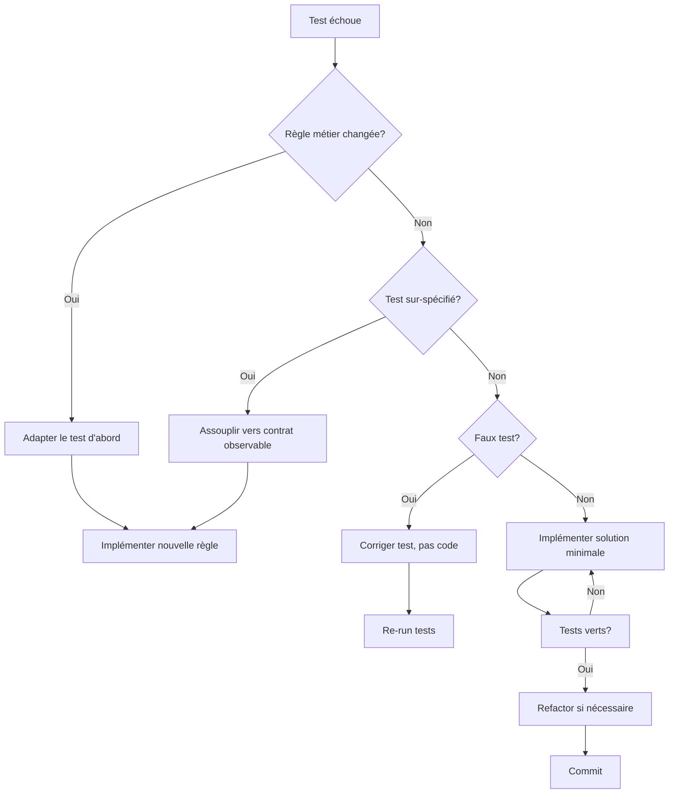

# CLAUDE - Configuration de Comportement HerbisVeritas V2

## 📋 Instructions Permanentes

Ce fichier définit les **patterns de comportement obligatoires** que Claude doit suivre systématiquement lors du développement de HerbisVeritas V2.

**⚠️ CRITIQUE : Claude DOIT consulter ce fichier avant CHAQUE action significative.**

---

## 🎯 Contexte Projet

- **Projet :** inherbisveritas (aka HerbisVeritas V2) - E-commerce cosmétique bio
- **Stack :** Next.js 15 + TypeScript + Supabase + next-intl 
- **Architecture :** MVP 13 tables, 12 semaines de développement
- **Objectif :** Launch-ready sous €125k budget

---

## 🔧 Patterns de Développement

### 1. **Lecture Systématique Obligatoire**
Avant TOUTE action, Claude DOIT lire dans cet ordre :
- [ ] `CLAUDE.md` (ce fichier)
- [ ] `docs/DEVELOPMENT_PLAN_MVP.md` (roadmap)
- [ ] `docs/DATABASE_SCHEMA_MVP.md` (schéma actuel)
- [ ] `.env.local` (configuration)

### 2. **Architecture MVP Stricte**
- ✅ **UNIQUEMENT** les 13 tables validées
- ✅ **UNIQUEMENT** les 7 labels HerbisVeritas définis
- ✅ **UNIQUEMENT** FR/EN pour MVP (DE/ES → V2)
- ✅ **UNIQUEMENT** 3 rôles users (user/admin/dev)
- ❌ **JAMAIS** ajouter de complexité non-MVP

### 3. **Gestion des Fichiers**
```bash
# TOUJOURS lire avant d'éditer
Read → Edit/Write
# JAMAIS écraser sans lire
# TOUJOURS préserver les patterns existants
```

### 3 bis Architecture Features Impérative

**⚠️ RÈGLES ANTI-DOUBLONS OBLIGATOIRES :**

#### **Organisation par Domaine Métier**
- ✅ **UNIQUEMENT src/features/[domain]/** pour logique métier
- ✅ **UNIQUEMENT src/components/** pour UI générique réutilisable
- ✅ **UNIQUEMENT src/lib/** pour utilitaires purs et configuration
- ✅ **UNIQUEMENT src/hooks/** pour hooks techniques génériques

#### **Structure Features Obligatoire**
```bash
src/features/[domain]/
├── components/          # Composants métier spécifiques
├── hooks/              # Hooks métier spécifiques  
├── services/           # API calls, business logic
├── store/              # Store Zustand si nécessaire
├── types.ts            # Types spécifiques domaine
└── index.ts            # API publique UNIQUEMENT
```

#### **Interdictions Strictes Anti-Doublons**
- ❌ **JAMAIS de logique métier** dans src/components/
- ❌ **JAMAIS de hooks métier** dans src/hooks/ (uniquement techniques)
- ❌ **JAMAIS de doublon fonctionnel** entre features/ et lib/
- ❌ **JAMAIS de réexports UI** depuis features/[domain]/index.ts
- ❌ **JAMAIS de types métier** dispersés (centralisés dans features/[domain]/types.ts)

#### **Validation Architecture Obligatoire**
**AVANT de créer TOUT fichier :**
```bash
# 1. Rechercher doublons fonctionnels existants
find src -name "*[keyword]*" -type f | grep -v test

# 2. Identifier domaine métier correct
auth → src/features/auth/
cart → src/features/cart/  
products → src/features/products/
ui générique → src/components/ui/
technique pur → src/lib/

# 3. Valider responsabilité unique
Métier spécifique → features/[domain]/
UI réutilisable → components/
Utilitaire pur → lib/
Hook technique → hooks/
```

#### **Règles Domaines Métier MVP**
- ✅ **auth/** : authentification, rôles, permissions
- ✅ **cart/** : panier, items, calculs, persistence  
- ✅ **products/** : catalogue, filtres, recherche
- ✅ **orders/** : commandes, checkout, paiement
- ❌ **INTERDICTION** créer nouveaux domaines sans validation MVP

#### **Process de Validation Anti-Doublons**
1. 🔍 **RECHERCHER** : `find src -name "*[nom]*" | head -10`
2. 📂 **IDENTIFIER** : Quel domaine métier ? (auth/cart/products/other)
3. 🎯 **PLACER** : features/[domain]/[type]/[filename]
4. ✅ **VALIDER** : Aucun doublon fonctionnel existant
5. 📝 **DOCUMENTER** : Rôle et responsabilité unique

**⚠️ CRITIQUE : Toute violation de ces règles = REFACTOR IMMÉDIAT obligatoire**

### 4. **Conventions Nommage Next.js (DEV.TO Best Practices)**

**Règles Strictes Basées sur Standards Industrie :**

#### **Fichiers & Dossiers :**
- ✅ **kebab-case** pour TOUS les fichiers et dossiers (`user-profile.tsx`, `data-table.tsx`)
- ✅ **Consistance absolue** → JAMAIS mélanger les conventions
- ✅ **Compatibilité cross-platform** → Windows/Linux/macOS
- ✅ **URL-friendly** structure pour SEO et navigation

#### **Composants React :**
- ✅ **PascalCase** pour noms composants (`function UserProfile()`, `const DataTable`)
- ✅ **Alignement** nom composant ↔ nom fichier (`user-profile.tsx` → `UserProfile`)
- ✅ **Descriptif** et business-oriented

#### **Structure Dossiers UI :**
```bash
src/components/
├── ui/                    # kebab-case (shadcn/ui standard)
│   ├── button.tsx         # kebab-case fichiers
│   ├── input.tsx         # PascalCase composants
│   └── data-table.tsx    # aligné avec DataTable component
├── features/             # modules métier kebab-case
│   ├── user-profile.tsx  
│   └── product-catalog.tsx
```

#### **Interdictions Absolues :**
- ❌ **Doublons casse** : `ui/` ET `UI/` (Git Windows conflict)
- ❌ **Mix conventions** : `UserProfile.tsx` + `data-table.tsx` dans même dossier
- ❌ **PascalCase dossiers** : `Components/` → `components/`
- ❌ **Underscores** : `user_profile.tsx` → `user-profile.tsx`

#### **Validation Pre-Commit :**
```bash
# Vérifier absence doublons casse
find src/ -name "*" | sort | uniq -i -c | sort -nr | head -5
# Must return 1 per unique filename (case-insensitive)
```

**Source :** [Next.js Component Naming Best Practices](https://dev.to/vikasparmar/nextjs-component-naming-conventions-best-practices-for-file-and-component-names-39o2)
- ❌ Interdiction de placer des fichiers **hors du dossier prévu** (ex. pas de composant dans `app/`).
- ❌ Interdiction de créer de nouveaux dossiers sans validation (valider avec plan MVP).

**Pattern obligatoire avant création :**
1. 📂 Vérifier si le fichier existe déjà (`git grep`, recherche projet).
2. 📖 Lire `docs/PROJECT_STRUCTURE.md` → identifier le bon dossier cible.
3. ✅ Créer le fichier uniquement si non existant, au bon emplacement.
---

### 5. **TodoWrite Obligatoire**
- ✅ Créer todo AVANT de commencer une tâche multi-étapes
- ✅ Marquer in_progress IMMÉDIATEMENT au début
- ✅ Marquer completed DÈS que fini
- ✅ Nettoyer la liste si obsolète

### 6. **Documentation Traçable**
Chaque modification DOIT être :
- 📝 Documentée
- 🏷️ Taguée avec version/date
- 🔗 Liée au plan MVP
- ✅ Validée contre l'architecture
- ✅ desvriptive (pas d'emphase, pas d"émojis", pas de signature Claude)

### 7. **Règles de Commit Strictes**
Format obligatoire : Conventional Commits en français
```bash
type(scope): description concise

# Exemples valides :
feat(auth): ajout système 3 rôles utilisateur
fix(cart): correction calcul total panier invité  
docs(schema): mise à jour architecture 13 tables
refactor(products): optimisation requêtes Supabase
```

**Interdictions commits :**
- ❌ Emojis/émoticons (🚀, ✅, etc.)
- ❌ Signatures Claude automatiques  
- ❌ Messages anglais
- ❌ Descriptions verbeuses

**Pattern obligatoire avant commit :**
1. 📋 Interroger développeur sur mise à jour documentation requise
2. 📋 C:\inherbisveritas\doc est le dossier de la documentation définitive
3. 📋 C:\inherbisveritas\docs est le dossier de la documentation temporaire
4. ✅ Valider cohérence avec plan MVP  
5. 🔍 Message concis décrivant uniquement les changements

**CHECKPOINT AUTO-VALIDATION COMMIT :** Voir Checklist Pré-Commit Unifiée section ✅

### 8. **Méthodologie TDD Obligatoire**
**Test-Driven Development (TDD) Pattern Strict :**
- 🔴 **RED** : Écrire test qui échoue AVANT le code
- 🟢 **GREEN** : Écrire le minimum de code pour faire passer le test
- 🔵 **REFACTOR** : Refactoriser en conservant les tests verts
- ✅ **JAMAIS** de code sans test correspondant

**Cycle TDD Application :**
```bash
# 1. Test unitaire AVANT implémentation
npm run test:unit -- --watch
# 2. Test intégration pour flows business
npm run test:integration 
# 3. Test e2e pour parcours utilisateur critiques
npm run test:e2e
```

**Structure Tests Obligatoire :**
```
tests/
├── unit/           # Jest + React Testing Library
│   ├── components/ # Tests composants isolés
│   ├── hooks/      # Tests hooks custom
│   ├── utils/      # Tests fonctions pures
├── integration/    # Tests API + Database
│   ├── api/        # Tests routes API
│   ├── auth/       # Tests auth flows
│   ├── database/   # Tests queries Supabase
├── e2e/           # Playwright + fixtures
│   ├── user-flows/ # Parcours utilisateur complets
│   ├── admin/      # Tests interface admin
```


### **Règles d'Adaptation Tests/Code**

#### 🔄 **Quand Adapter les Tests :**

**✅ Exigence métier change :**
- Nouvelle règle business → Met d'abord le test à jour, puis code
- Cas d'usage ajouté/supprimé → Test d'abord, implémentation ensuite

**✅ Test sur-spécifié :**
- Détails d'implémentation → Assouplis vers contrat observable
- Ordre non garanti, timestamps exacts, IDs → Focus comportement utilisateur
- Exemple : `expect(users).toHaveLength(3)` au lieu de `expect(users[0].id).toBe('uuid-123')`

**✅ Faux test identifié :**
- Assertion erronée → Corrige le test, pas le code
- Fixture invalide → Répare la donnée de test
- Test flaky → Stabilise le test (mocks déterministes)

**✅ Refactor API publique :**
- Breaking change décidé → Réécris tests de contrat + migration
- Garde compatibilité durant transition → Tests doubles temporaires

**✅ Régression reproduite :**
- Test rouge ajouté pour repro → Garde ce test, il devient cible du correctif

#### 🔧 **Quand Adapter le Code :**

**✅ Test rouge légitime :**
- Contrat valide non respecté → Implémente solution minimale pour passer vert
- Pas de sur-ingénierie → Juste assez pour satisfaire le test

**✅ Étape Refactor (après vert) :**
- Améliore lisibilité, factorise, injecte dépendances
- SANS changer les tests existants
- Si tests cassent durant refactor → Le refactor change trop le contrat

**✅ Code difficile à tester :**
- Couplage/side-effects → Introduis seams (ports/adapters)
- Temps/UUID → Injecte horloge/générateur
- I/O → Mock ou injecte dépendances
- Exemple : `getUserById(id, db)` au lieu de `user.fetchFromDatabase()`

**✅ Performance/robustesse :**
- Mesurées par tests → Optimise en conservant assertions existantes
- Tests performance séparés → Ne pas ralentir suite principale

**✅ Bug confirmé :**
- Repro par test → Corrige le code, test reste comme filet de sécurité

#### ⚠️ **Garde-fous Critiques :**

**❌ Ne JAMAIS :**
- Modifier test "pour le faire passer" si règle métier inchangée
- Tester structure interne au lieu de comportement observable
- Supprimer test qui échoue sans comprendre pourquoi

**✅ TOUJOURS :**
- Nouveau correctif = nouveau test qui échouait avant
- 90% tests unitaires, rapides, déterministes
- I/O, temps, hasard → injectés ou mockés
- Test doit pointer contrat réel (comportement utilisateur observable)

#### 🎯 **Contrats vs Implémentation HerbisVeritas :**

**✅ Test contrat observable :**
```javascript
// BON - Teste le comportement utilisateur
expect(screen.getByText('Commande confirmée')).toBeInTheDocument()
expect(mockStripeCharge).toHaveBeenCalledWith({ amount: 5390 })
```

**❌ Test implémentation interne :**
```javascript
// MAUVAIS - Teste détails internes
expect(component.state.isLoading).toBe(false)
expect(paymentService.internals.retryCount).toBe(3)
```

**✅ Fixtures déterministes :**
```javascript
// BON - Données prévisibles
const mockUser = { id: 'user-123', email: 'test@herbisveritas.fr' }
const mockDate = new Date('2025-01-01T10:00:00Z')
```

**❌ Données aléatoires :**
```javascript
// MAUVAIS - Non reproductible
const mockUser = { id: generateUUID(), createdAt: new Date() }
```

### 9. **Workflow TDD Décisionnel**

**🔄 Processus de décision Tests vs Code :**



### 10. **Flux de Données Standardisé (Dataflow)**

**Architecture obligatoire :** DB → DTO → ViewModel → UI
- ✅ **Commentaires ROOT** en tête de chaque fichier du flux
- ✅ **DTO_VERSION** pour invalidation cache et évolution
- ✅ **Validation Zod** stricte des schemas
- ✅ **Mappers purs** sans side-effects
- ✅ **React Query** avec clés déterministes
- ❌ **AUCUN** fetch direct dans composants
- ❌ **AUCUNE** mutation state côté client
- ❌ **AUCUNE** logique métier dans l'UI

**Référence :** `docs/claude/dataflow-products.md` (source de vérité)

### 11. **Règles de Documentation**
**Style obligatoire :**
- ✅ Ton neutre, purement descriptif
- ✅ Langage technique précis
- ✅ Structure logique avec sections claires
- ❌ Emphase excessive (gras/italique abusif)  
- ❌ Emojis/émoticons
- ❌ Formulation marketing/commerciale

**Validation documentation :**
- Chaque nouveau fichier .md doit être approuvé explicitement
- Documentation existante : modification seulement si demandée
- Interroger sur opportunité mise à jour avant chaque commit

---

## 🚫 Interdictions Strictes

### ❌ **Ne JAMAIS faire :**
- Créer des tables non-MVP
- Ajouter des langues autres que FR/EN
- Complexifier au-delà du plan MVP
- Modifier le schéma 13 tables sans validation
- Ignorer les 7 labels HerbisVeritas définis
- Créer des features non-planifiées
- Bypasser la documentation

### ❌ **Ne JAMAIS oublier :**
- Lire CLAUDE.md avant chaque action
- Vérifier l'architecture MVP
- Documenter les changements
- Maintenir la traçabilité
- Respecter le budget temps/complexité
- **Écrire les tests AVANT le code (TDD strict)**
- **Valider couverture tests > 80%**
- **Exécuter suite tests avant commit**

---

## ✅ Checklist Pré-Commit Unifiée

### **Validation Architecture MVP**
- [ ] **Cohérence MVP** : Est-ce dans le plan 12 semaines ?
- [ ] **Architecture** : Respecte les 13 tables ?
- [ ] **Business** : Sert les objectifs de lancement ?
- [ ] **Simplicité** : Minimal viable ?
- [ ] **Documentation** : Traçable pour nouveaux devs ?

### **Validation TDD & Tests**
- [ ] **Tests TDD** : Tests écrits AVANT le code ?
- [ ] **Couverture** : > 80% des lignes testées ?
- [ ] **Performance** : Tests Core Web Vitals < 2s ?
- [ ] Tests unitaires pour chaque fonction/composant
- [ ] Tests flows business critiques
- [ ] Tests parcours utilisateur MVP

### **Validation Client/Serveur Next.js**
- [ ] Composants serveur par défaut, chaque "use client" justifié
- [ ] Aucun secret/SDK serveur/fs/ORM importé en client (`server-only` sur helpers sensibles)
- [ ] Props Server→Client sérialisables (pas classes/fonctions/Date brutes)
- [ ] Pas d'accès window/localStorage au render serveur
- [ ] `NEXT_PUBLIC_*` uniquement variables réellement publiques
- [ ] Pas de double fetch inutile serveur/client

### **Validation Mobile-First Responsive**
- [ ] Testé sur viewport 320px (iPhone SE)
- [ ] Navigation mobile fonctionnelle sans JS
- [ ] Texte lisible sans zoom (min 16px)
- [ ] Boutons/liens touch-friendly (min 44px)
- [ ] Performance < 3s First Contentful Paint (mobile)
- [ ] Core Web Vitals validés sur mobile

### **Validation Commits**
- [ ] FORMAT: type(scope): description concise en français
- [ ] EMOJIS: Aucun emoji présent (🚀, ✅, 🤖)
- [ ] SIGNATURES: Aucune signature Claude automatique
- [ ] LANGUE: Message 100% français
- [ ] LONGUEUR: Description concise < 60 caractères

---

## 🎯 Objectifs Business à Garder en Tête

- 🚀 **Launch ready** en 12 semaines maximum
- 💰 **Budget** sous €125k année 1  
- 👥 **Support** 1,000+ utilisateurs simultanés
- 🛒 **E-commerce** complet (panier invité + Stripe)
- 📝 **CMS** autonome pour contenu
- 🏷️ **Labels HerbisVeritas** + système partenaires
- 🌐 **i18n** FR/EN seulement

---

## 12. **Frontière Client/Serveur Next.js 15**

### Règles Obligatoires
Éviter fuites de secrets, erreurs d'hydratation, bloat du bundle et bugs de runtime en respectant strictement la séparation Client/Serveur Next.js 15 App Router.

#### **Choix du type de composant**
- ✅ **Par défaut Server Components** - Passer en Client uniquement si interactivité/hooks/APIs navigateur nécessaires
- ✅ **"use client"** entraîne tout son graphe d'imports côté client → attention imports involontaires
- ✅ **Network Boundary** : data + rendu serveur, micro-interactions client

#### **Secrets & code serveur uniquement**
- ✅ Taguer modules sensibles avec `import "server-only"` en tête → casse build si import côté client
- ❌ **JAMAIS** exposer variables d'env avec `NEXT_PUBLIC_` si sensibles → inlinées dans bundle
- ✅ SDK serveur (Stripe Node, ORM, fs) → `server-only` obligatoire

#### **Sérialisation Server → Client**
- ✅ **Uniquement objets JSON sérialisables** en props vers Client Components
- ❌ **JAMAIS** classes, fonctions, Dates non sérialisées entre Server/Client

#### **Hydratation & logique client-only**
- ❌ **Aucun accès** window/localStorage/Date.now() pendant render serveur
- ✅ **Déplacer dans useEffect** ou isoler via client component
- ✅ Contenu volontairement différent client/serveur → déférer au montage

#### **Imports et bundle**
- ❌ **Éviter** import libs lourdes/serveur depuis modules client → grossit bundle
- ✅ **dynamic(() => import(...), { ssr: false })** uniquement pour strict client-only
- ✅ **Runtime Node.js** par défaut, Edge réservé cas adaptés

#### **Data fetching & cache**
- ✅ **Server Components** : fetch/ORM côté serveur avec `cache: 'no-store'` ou `next: { revalidate: N }`
- ❌ **Éviter double fetch** SSR puis refetch client si non nécessaire

---

## 13. **Règles de Taille de Fichiers**

### **Limites Obligatoires par Type**

#### **Composants UI** (`src/components/**`)
- ✅ **< 150 lignes max** par fichier
- ✅ **Responsabilité unique** : affichage + interactions basiques seulement
- ✅ **Logique métier** → extraire dans hooks (`src/hooks/`) ou utilitaires (`src/lib/`)
- ✅ **Sous-composants** → découper en fichiers séparés si complexité

#### **Features Business** (`src/features/**`)
- ✅ **< 200 lignes max** par fichier (inclut UI + logique spécifique feature)
- ✅ **Périmètre** : UI + logique business d'une feature précise
- ✅ **Composition** : utiliser composants génériques de `src/components/`
- ✅ **État complexe** → hooks dédiés dans `src/hooks/use-[feature].ts`

#### **Services & Utilitaires** (`src/lib/**`)
- ✅ **< 300 lignes max** par fichier (services, utils, hooks, API clients)
- ✅ **Granularité** : un service = un domaine (ex: `auth.ts`, `products.ts`, `cart.ts`)
- ✅ **Réutilisabilité** : fonctions pures privilégiées
- ✅ **Tests** : coverage > 90% obligatoire (logique critique)

#### **Pages App Router** (`src/app/**`)
- ✅ **< 100 lignes max** par page (hors imports et types)
- ✅ **Composition pure** : assembly de composants + data fetching uniquement
- ✅ **Logique métier interdite** → déplacer dans `src/lib/` ou hooks
- ✅ **Layout** → utiliser composants layout de `src/components/layout/`

### **Actions en Cas de Dépassement**

#### **Stratégies de Refactoring**
```bash
# Composant > 150 lignes
→ Extraire logique dans hook: src/hooks/use-[domain].ts
→ Créer sous-composants: src/components/[domain]/[sub-component].tsx
→ Séparer state management: context ou store Zustand

# Feature > 200 lignes  
→ Diviser en sous-features: src/features/[feature]/[sub-feature]/
→ Extraire UI generique: src/components/ui/
→ Créer hooks spécialisés: src/features/[feature]/hooks/

# Service > 300 lignes
→ Découper par domaine: auth.ts → auth/login.ts, auth/register.ts  
→ Séparer types: src/types/[domain].ts
→ Modulariser API calls: src/lib/api/[endpoint].ts

# Page > 100 lignes
→ Créer composant page: src/components/pages/[page-name].tsx
→ Extraire data fetching: src/lib/queries/[domain].ts  
→ Simplifier layout: src/components/layout/[layout-name].tsx
```

#### **Process de Refactoring Obligatoire**
```bash
# Si fichier > 400 lignes → REFACTOR IMMEDIAT
1. 🛑 STOPPER le développement de features
2. 📋 Créer task refactor: dans TodoWrite  
3. 🧪 Tests d'abord: maintenir couverture existante
4. ✂️ Découper selon responsabilités
5. 📝 Commit: "refactor(scope): description détaillée"
6. 🎯 Valider: aucune régression fonctionnelle
```

### **Exceptions Autorisées**
- ✅ **Tests** (`*.test.tsx`): longueur libre, mais factoriser fixtures/builders
- ✅ **Configuration** (`*.config.js`, `*.config.ts`): exemptés des règles  
- ✅ **Types générés** (`src/types/database.ts`): auto-générés Supabase
- ✅ **Migrations** (`supabase/migrations/*.sql`): logique SQL complète

### **Validation Automatique**

#### **Script de Vérification** (à ajouter)
```json
{
  "scripts": {
    "lint:file-length": "find src -name '*.tsx' -o -name '*.ts' | xargs wc -l | awk '$1 > 150 && $2 ~ /components/ { print \"❌ Component \" $2 \": \" $1 \" lignes (max 150)\" } $1 > 200 && $2 ~ /features/ { print \"❌ Feature \" $2 \": \" $1 \" lignes (max 200)\" } $1 > 300 && $2 ~ /lib/ { print \"❌ Service \" $2 \": \" $1 \" lignes (max 300)\" } $1 > 100 && $2 ~ /app.*page/ { print \"❌ Page \" $2 \": \" $1 \" lignes (max 100)\" }'",
    "pre-commit": "npm run lint:file-length && npm run lint && npm run typecheck"
  }
}
```

#### **Intégration Git Hooks**
```bash
# .husky/pre-commit  
npm run lint:file-length || exit 1
# Bloque commit si dépassement des limites
```

### **Justification Architecture MVP**
- 🚀 **Maintenabilité** : code facile à comprendre et modifier
- 🧪 **Testabilité** : composants petits = tests focalisés  
- 👥 **Collaboration** : revues de code rapides et efficaces
- 📈 **Évolutivité** : ajout features sans casser l'existant
- ⚡ **Performance** : bundle size maîtrisé, tree-shaking efficace

---

## 14. **Architecture Mobile-First Obligatoire**

### Principes Fondamentaux Bootstrap/Foundation

**Philosophie Mobile-First :**
- ✅ **Styles de base** pour petits écrans (xs: 0px)
- ✅ **Media queries min-width** pour écrans plus grands
- ✅ **Performance optimisée** : CSS minimal sur mobile
- ✅ **Progressive enhancement** : fonctionnalités ajoutées par breakpoint

#### **Breakpoints Standard MVP**
```scss
$grid-breakpoints: (
  xs: 0,        // Mobile portrait
  sm: 576px,    // Mobile landscape  
  md: 768px,    // Tablet portrait
  lg: 992px,    // Tablet landscape / Desktop
  xl: 1200px,   // Desktop large
  xxl: 1400px   // Desktop extra-large
);
```

#### **Responsive Design Patterns Obligatoires**

**✅ Composants Adaptatifs :**
- Navigation mobile → hamburger menu (< md)
- Navigation desktop → horizontal menu (≥ md)
- Cards → stack vertical (< lg), grid horizontal (≥ lg)
- Images → responsive avec `.img-fluid` ou `max-width: 100%`

**✅ Typography Mobile-First :**
```scss
// Base mobile
h1 { font-size: 1.5rem; line-height: 1.2; }

// Progressive enhancement
@include media-breakpoint-up(md) {
  h1 { font-size: 2rem; }
}
@include media-breakpoint-up(lg) {
  h1 { font-size: 2.5rem; }
}
```

#### **Interaction Patterns Mobile**

**✅ Touch-Friendly :**
- Boutons min 44px × 44px (recommandation Apple/Google)
- Espacement min 8px entre éléments cliquables
- Zones d'interaction étendues pour liens texte

**✅ Navigation Gestuelle :**
- Swipe horizontal pour carrousels produits
- Pull-to-refresh sur listes (si applicable)
- Scroll vertical fluide sans pagination forcée

#### **Performance Mobile**

**✅ Optimisations Critiques :**
- Images responsive avec `srcset` et `sizes`
- Lazy loading automatique pour images produits
- CSS critique inline, CSS non-critique asynchrone
- JavaScript progressif : core mobile, enhancement desktop

**✅ Network Boundary Mobile :**
```scss
// Critical mobile CSS (inline)
.btn, .container, .row, .col { /* base styles */ }

// Enhancement CSS (async load)
@media (min-width: 768px) {
  .complex-animations { /* desktop enhancements */ }
}
```

#### **Validation Responsive Obligatoire**

**Tests Devices Obligatoires :**
```bash
# Playwright mobile testing
npm run test:e2e -- --project=mobile
# Viewports: 375×667 (iPhone), 414×896 (iPhone Plus), 360×640 (Android)
```

#### **CSS Architecture Mobile-First**

**✅ Structure SCSS Recommandée :**
```scss
// 1. Base mobile styles
@import 'base/mobile-first';

// 2. Components responsive
@import 'components/button';
@import 'components/navigation';

// 3. Layout breakpoints
@import 'layout/mobile';      // xs-sm
@import 'layout/tablet';      // md
@import 'layout/desktop';     // lg+

// 4. Utilities responsive
@import 'utilities/spacing';
@import 'utilities/display';
```

**✅ Naming Convention Responsive :**
```scss
// Classes responsive suivant Bootstrap pattern
.d-block              // visible sur tous écrans
.d-none .d-md-block   // caché mobile, visible tablet+
.d-lg-flex            // flex uniquement desktop+
.text-center .text-md-left  // centré mobile, aligné gauche tablet+
```

### Patterns Anti-FOUC (Flash of Unstyled Content)

**✅ Protection JavaScript Loading :**
```css
.no-js .mobile-menu { display: block; }
.no-js .desktop-menu { display: none; }

@media (min-width: 768px) {
  .no-js .mobile-menu { display: none; }
  .no-js .desktop-menu { display: block; }
}
```

**✅ Progressive Enhancement HerbisVeritas :**
- Formulaires fonctionnels sans JS (HTML5 validation)
- Navigation accessible clavier + screen readers
- Images avec alt text descriptif
- Contenu principal accessible même si CSS échoue

---

## 15. **Workflow Anti-Doublons Obligatoire**

### **Checklist AVANT Création de Fichier**

**⚠️ PROCES MANDATORY - 0 EXCEPTION :**

```bash
# ÉTAPE 1 : Recherche doublons existants
find src -name "*[keyword]*" -type f | grep -v test

# ÉTAPE 2 : Validation responsabilité  
if [logique_métier]; then
  destination="src/features/[domain]/"
elif [ui_générique]; then
  destination="src/components/ui/"
elif [utilitaire_pur]; then
  destination="src/lib/"
elif [hook_technique]; then
  destination="src/hooks/"
else
  STOP → Clarifier responsabilité
fi

# ÉTAPE 3 : Validation unicité
if [doublon_fonctionnel_exists]; then
  STOP → Utiliser existant ou refactoriser
fi

# ÉTAPE 4 : Validation MVP
if [non_MVP_feature]; then
  STOP → Reporter V2
fi
```

### **Workflow Standard**

```mermaid
graph TD
    A[Demande utilisateur] --> B[Lire CLAUDE.md]
    B --> C[Checklist Anti-Doublons]
    C --> D[Recherche doublons existants]
    D --> E{Doublon détecté?}
    E -->|Oui| F[UTILISER existant ou REFACTORISER]
    E -->|Non| G[Valider domaine métier correct]
    G --> H[Placer dans features/[domain]/]
    H --> I[TodoWrite]
    I --> J[Implémenter Mobile-First]
    J --> K[Tester Responsive]
    K --> L[Documenter]
    L --> M[Marquer complété]
    F --> N[Analyser architecture existante]
    N --> O[Proposer refactoring si nécessaire]
```

---

## 📞 Points d'Escalade

### **Conflits Architecture vs Demande**
Si **conflit** entre demande utilisateur et architecture MVP :
1. 🛑 **STOPPER** l'action
2. 📋 **EXPLIQUER** le conflit architecture
3. 💡 **PROPOSER** alternative MVP-compliant
4. ✅ **ATTENDRE** validation utilisateur
5. 📝 **DOCUMENTER** la décision

### **Détection de Doublons OBLIGATOIRE**
Si **doublon fonctionnel détecté** :
1. 🚨 **ALERTER** immédiatement l'utilisateur
2. 📍 **LISTER** tous les emplacements du doublon
3. 🎯 **PROPOSER** architecture unifiée cohérente
4. 🔄 **SUGGÉRER** refactoring selon features/[domain]/
5. ❌ **INTERDIRE** création nouveau doublon
6. ✅ **DOCUMENTER** décision d'unification

### **Violation Règles Architecture CRITIQUE**
Si **violation des règles anti-doublons** :
1. 🛑 **REFUSER** catégoriquement l'action
2. 📋 **CITER** la règle violée dans CLAUDE.md
3. 🏗️ **EXPLIQUER** architecture correcte attendue
4. 📝 **RÉFÉRENCER** section CLAUDE.md applicable
5. ✅ **ATTENDRE** reformulation conforme

---

## 🔧 Configuration Supabase

- **Project ID :** `mntndpelpvcskirnyqvx`
- **URL :** `https://mntndpelpvcskirnyqvx.supabase.co`
- **Migration actuelle :** `001_mvp_schema.sql`
- **État attendu :** 13 tables + 7 enums + RLS

---

## 📚 Références Critiques

- `docs/DEVELOPMENT_PLAN_MVP.md` → Planning 12 semaines
- `docs/DATABASE_SCHEMA_MVP.md` → Architecture technique
- `docs/claude/dataflow-products.md` → **Flux de données produits standardisé**
- `src/types/database.ts` → Types TypeScript MVP
- `src/lib/types/domain/product.ts` → Types produits unifiés (DTO_VERSION: 1)
- `supabase/migrations/001_mvp_schema.sql` → Schéma SQL
- `package.json` scripts → Commandes npm
- `jest.config.js` → Configuration tests unitaires
- `playwright.config.ts` → Configuration tests e2e
- `shortcuts.md` → Liste des raccourcis et aliases terminaux

---

## 🎮 Shortcuts Terminal Disponibles

**Référence complète :** `shortcuts.md`

**Shortcuts principaux :**
- `cc` → Consulte CLAUDE.md et applique les patterns définis
- `dp` → Consulte docs/DEVELOPMENT_PLAN_MVP.md et indique où nous en sommes
- `orthodox` → Vérifie cohérence entre docs/DEVELOPMENT_PLAN_MVP.md, docs/DATABASE_SCHEMA_MVP.md et architecture 13 tables
- `github` → Analyse pending changes, commit selon patterns CLAUDE.md et push vers remote
- `build` → Lance npm run build + vérification erreurs + rapport de performance + validation MVP
- `c7` → Commençons la prochaine étape recommandée avec recherche Context7 + génération NEXT_STEP.md

**Usage :** Taper le shortcut dans terminal, puis copier-coller dans Claude Code

---

**Version :** 1.0.0  
**Dernière MAJ :** 2025-01-28  
**Statut :** ✅ ACTIF

---

## 🎯 Règles Générales de Prévention

### **Prévention Doublons Architecturaux**

**Causes racines identifiées des incohérences :**
- ❌ Refactoring partiel sans vision globale
- ❌ Création fichiers sans recherche préalable
- ❌ Mélange responsabilités (métier vs UI vs technique)
- ❌ Architecture features/ incohérente avec lib/ et hooks/

**Principes préventifs obligatoires :**
- ✅ **Toujours rechercher l'existant AVANT de créer**
- ✅ **Une seule source de vérité par responsabilité**
- ✅ **Refactoring complet ou pas de refactoring**
- ✅ **Architecture cohérente sur tout le projet**
- ✅ **Validation architecture à chaque modification structurelle**

### **Standards de Cohérence MVP**

**Domaines métier autorisés UNIQUEMENT :**
- `auth/` : authentification, rôles, sessions
- `cart/` : panier, items, calculs, persistence
- `products/` : catalogue, filtres, recherche, détails
- `orders/` : commandes, checkout, paiement

**Séparation responsabilités stricte :**
- `src/features/[domain]/` → Logique métier exclusive
- `src/components/` → UI générique réutilisable exclusive
- `src/lib/` → Configuration et utilitaires purs exclusive
- `src/hooks/` → Hooks techniques génériques exclusive

**Claude : Consulter ces règles générales avant CHAQUE action structurelle !**