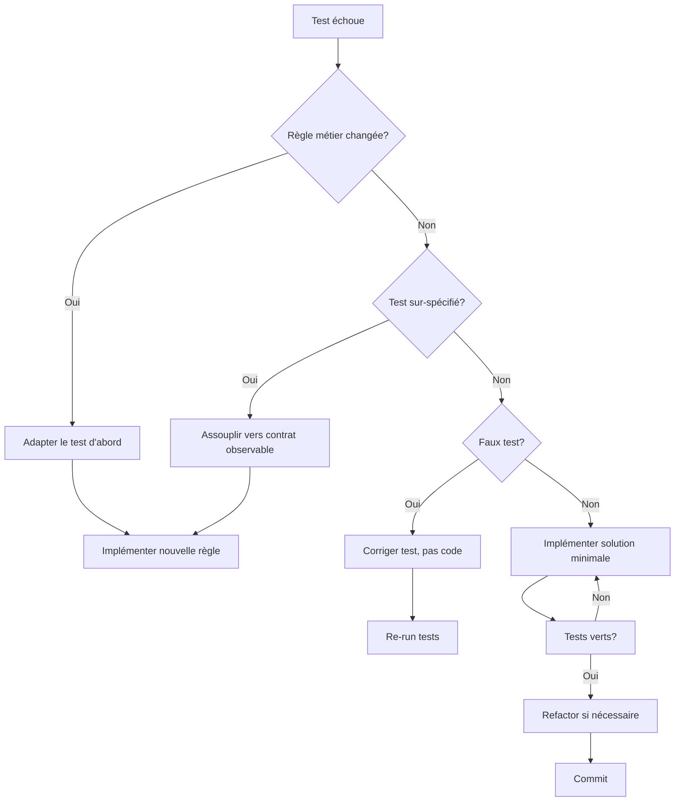
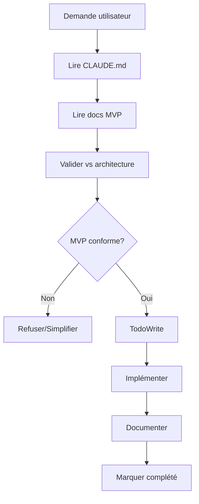

# CLAUDE - Configuration de Comportement HerbisVeritas V2

## 📋 Instructions Permanentes

Ce fichier définit les **patterns de comportement obligatoires** que Claude doit suivre systématiquement lors du développement de HerbisVeritas V2.

**⚠️ CRITIQUE : Claude DOIT consulter ce fichier avant CHAQUE action significative.**

---

## 🎯 Contexte Projet

- **Projet :** inherbisveritas (aka HerbisVeritas V2) - E-commerce cosmétique bio
- **Stack :** Next.js 15 + TypeScript + Supabase + next-intl 
- **Architecture :** MVP 13 tables, 12 semaines de développement
- **Objectif :** Launch-ready sous €125k budget

---

## 🔧 Patterns de Développement

### 1. **Lecture Systématique Obligatoire**
Avant TOUTE action, Claude DOIT lire dans cet ordre :
- [ ] `CLAUDE.md` (ce fichier)
- [ ] `docs/DEVELOPMENT_PLAN_MVP.md` (roadmap)
- [ ] `docs/DATABASE_SCHEMA_MVP.md` (schéma actuel)
- [ ] `.env.local` (configuration)

### 2. **Architecture MVP Stricte**
- ✅ **UNIQUEMENT** les 13 tables validées
- ✅ **UNIQUEMENT** les 7 labels HerbisVeritas définis
- ✅ **UNIQUEMENT** FR/EN pour MVP (DE/ES → V2)
- ✅ **UNIQUEMENT** 3 rôles users (user/admin/dev)
- ❌ **JAMAIS** ajouter de complexité non-MVP

### 3. **Gestion des Fichiers**
```bash
# TOUJOURS lire avant d'éditer
Read → Edit/Write
# JAMAIS écraser sans lire
# TOUJOURS préserver les patterns existants
```

### 3 bis Structure & Placement des Fichiers

- ✅ Respecter la structure de dossiers définie dans `docs/PROJECT_STRUCTURE.md`.
- ✅ Vérifier avant création qu'un fichier **de même nom ou rôle n'existe pas déjà** ailleurs.
- ✅ Centraliser les composants génériques dans `src/components/`, les pages dans `app/`, et les tests dans `tests/`.
- ✅ Les noms de fichiers doivent suivre la convention définie (`PascalCase` pour composants, `kebab-case` pour fichiers utilitaires).
- ❌ Interdiction de créer un **doublon fonctionnel** (ex. `Cart.tsx` et `Cart/index.tsx`).

### 4. **Conventions Nommage Next.js (DEV.TO Best Practices)**

**Règles Strictes Basées sur Standards Industrie :**

#### **Fichiers & Dossiers :**
- ✅ **kebab-case** pour TOUS les fichiers et dossiers (`user-profile.tsx`, `data-table.tsx`)
- ✅ **Consistance absolue** → JAMAIS mélanger les conventions
- ✅ **Compatibilité cross-platform** → Windows/Linux/macOS
- ✅ **URL-friendly** structure pour SEO et navigation

#### **Composants React :**
- ✅ **PascalCase** pour noms composants (`function UserProfile()`, `const DataTable`)
- ✅ **Alignement** nom composant ↔ nom fichier (`user-profile.tsx` → `UserProfile`)
- ✅ **Descriptif** et business-oriented

#### **Structure Dossiers UI :**
```bash
src/components/
├── ui/                    # kebab-case (shadcn/ui standard)
│   ├── button.tsx         # kebab-case fichiers
│   ├── input.tsx         # PascalCase composants
│   └── data-table.tsx    # aligné avec DataTable component
├── features/             # modules métier kebab-case
│   ├── user-profile.tsx  
│   └── product-catalog.tsx
```

#### **Interdictions Absolues :**
- ❌ **Doublons casse** : `ui/` ET `UI/` (Git Windows conflict)
- ❌ **Mix conventions** : `UserProfile.tsx` + `data-table.tsx` dans même dossier
- ❌ **PascalCase dossiers** : `Components/` → `components/`
- ❌ **Underscores** : `user_profile.tsx` → `user-profile.tsx`

#### **Validation Pre-Commit :**
```bash
# Vérifier absence doublons casse
find src/ -name "*" | sort | uniq -i -c | sort -nr | head -5
# Must return 1 per unique filename (case-insensitive)
```

**Source :** [Next.js Component Naming Best Practices](https://dev.to/vikasparmar/nextjs-component-naming-conventions-best-practices-for-file-and-component-names-39o2)
- ❌ Interdiction de placer des fichiers **hors du dossier prévu** (ex. pas de composant dans `app/`).
- ❌ Interdiction de créer de nouveaux dossiers sans validation (valider avec plan MVP).

**Pattern obligatoire avant création :**
1. 📂 Vérifier si le fichier existe déjà (`git grep`, recherche projet).
2. 📖 Lire `docs/PROJECT_STRUCTURE.md` → identifier le bon dossier cible.
3. ✅ Créer le fichier uniquement si non existant, au bon emplacement.
---

### 4. **TodoWrite Obligatoire**
- ✅ Créer todo AVANT de commencer une tâche multi-étapes
- ✅ Marquer in_progress IMMÉDIATEMENT au début
- ✅ Marquer completed DÈS que fini
- ✅ Nettoyer la liste si obsolète

### 5. **Documentation Traçable**
Chaque modification DOIT être :
- 📝 Documentée avec raison business
- 🏷️ Taguée avec version/date
- 🔗 Liée au plan MVP
- ✅ Validée contre l'architecture

### 6. **Règles de Commit Strictes**
Format obligatoire : Conventional Commits en français
```bash
type(scope): description concise

# Exemples valides :
feat(auth): ajout système 3 rôles utilisateur
fix(cart): correction calcul total panier invité  
docs(schema): mise à jour architecture 13 tables
refactor(products): optimisation requêtes Supabase
```

**Interdictions commits :**
- ❌ Emojis/émoticons (🚀, ✅, etc.)
- ❌ Signatures Claude automatiques  
- ❌ Messages anglais
- ❌ Descriptions verbeuses

**Pattern obligatoire avant commit :**
1. 📋 Interroger développeur sur mise à jour documentation requise
2. 📋 C:\inherbisveritas\doc est le dossier de la documentation définitive
3. 📋 C:\inherbisveritas\docs est le dossier de la documentation temporaire
4. ✅ Valider cohérence avec plan MVP  
5. 🔍 Message concis décrivant uniquement les changements

**CHECKPOINT AUTO-VALIDATION COMMIT (Anthropic Best Practice) :**
Avant CHAQUE commit, Claude DOIT valider :
```xml
<commit_validation>
- FORMAT: type(scope): description concise en français ✓/✗
- EMOJIS: Aucun emoji présent (🚀, ✅, 🤖) ✓/✗  
- SIGNATURES: Aucune signature Claude automatique ✓/✗
- LANGUE: Message 100% français ✓/✗
- LONGUEUR: Description concise < 60 caractères ✓/✗
</commit_validation>
```

**SI UNE SEULE VALIDATION ÉCHOUE → REGERERER LE MESSAGE**

### 7. **Méthodologie TDD Obligatoire**
**Test-Driven Development (TDD) Pattern Strict :**
- 🔴 **RED** : Écrire test qui échoue AVANT le code
- 🟢 **GREEN** : Écrire le minimum de code pour faire passer le test
- 🔵 **REFACTOR** : Refactoriser en conservant les tests verts
- ✅ **JAMAIS** de code sans test correspondant

**Cycle TDD Application :**
```bash
# 1. Test unitaire AVANT implémentation
npm run test:unit -- --watch
# 2. Test intégration pour flows business
npm run test:integration 
# 3. Test e2e pour parcours utilisateur critiques
npm run test:e2e
```

**Structure Tests Obligatoire :**
```
tests/
├── unit/           # Jest + React Testing Library
│   ├── components/ # Tests composants isolés
│   ├── hooks/      # Tests hooks custom
│   ├── utils/      # Tests fonctions pures
├── integration/    # Tests API + Database
│   ├── api/        # Tests routes API
│   ├── auth/       # Tests auth flows
│   ├── database/   # Tests queries Supabase
├── e2e/           # Playwright + fixtures
│   ├── user-flows/ # Parcours utilisateur complets
│   ├── admin/      # Tests interface admin
```

**Validation TDD Pré-Commit :**
```xml
<tdd_validation>
- COVERAGE: Couverture > 80% lignes ✓/✗
- UNIT_TESTS: Tests unitaires pour chaque fonction/composant ✓/✗  
- INTEGRATION: Tests flows business critiques ✓/✗
- E2E: Tests parcours utilisateur MVP ✓/✗
- PERFORMANCE: Tests < 2s Core Web Vitals ✓/✗
</tdd_validation>
```

### **Règles d'Adaptation Tests/Code**

#### 🔄 **Quand Adapter les Tests :**

**✅ Exigence métier change :**
- Nouvelle règle business → Met d'abord le test à jour, puis code
- Cas d'usage ajouté/supprimé → Test d'abord, implémentation ensuite

**✅ Test sur-spécifié :**
- Détails d'implémentation → Assouplis vers contrat observable
- Ordre non garanti, timestamps exacts, IDs → Focus comportement utilisateur
- Exemple : `expect(users).toHaveLength(3)` au lieu de `expect(users[0].id).toBe('uuid-123')`

**✅ Faux test identifié :**
- Assertion erronée → Corrige le test, pas le code
- Fixture invalide → Répare la donnée de test
- Test flaky → Stabilise le test (mocks déterministes)

**✅ Refactor API publique :**
- Breaking change décidé → Réécris tests de contrat + migration
- Garde compatibilité durant transition → Tests doubles temporaires

**✅ Régression reproduite :**
- Test rouge ajouté pour repro → Garde ce test, il devient cible du correctif

#### 🔧 **Quand Adapter le Code :**

**✅ Test rouge légitime :**
- Contrat valide non respecté → Implémente solution minimale pour passer vert
- Pas de sur-ingénierie → Juste assez pour satisfaire le test

**✅ Étape Refactor (après vert) :**
- Améliore lisibilité, factorise, injecte dépendances
- SANS changer les tests existants
- Si tests cassent durant refactor → Le refactor change trop le contrat

**✅ Code difficile à tester :**
- Couplage/side-effects → Introduis seams (ports/adapters)
- Temps/UUID → Injecte horloge/générateur
- I/O → Mock ou injecte dépendances
- Exemple : `getUserById(id, db)` au lieu de `user.fetchFromDatabase()`

**✅ Performance/robustesse :**
- Mesurées par tests → Optimise en conservant assertions existantes
- Tests performance séparés → Ne pas ralentir suite principale

**✅ Bug confirmé :**
- Repro par test → Corrige le code, test reste comme filet de sécurité

#### ⚠️ **Garde-fous Critiques :**

**❌ Ne JAMAIS :**
- Modifier test "pour le faire passer" si règle métier inchangée
- Tester structure interne au lieu de comportement observable
- Supprimer test qui échoue sans comprendre pourquoi

**✅ TOUJOURS :**
- Nouveau correctif = nouveau test qui échouait avant
- 90% tests unitaires, rapides, déterministes
- I/O, temps, hasard → injectés ou mockés
- Test doit pointer contrat réel (comportement utilisateur observable)

#### 🎯 **Contrats vs Implémentation HerbisVeritas :**

**✅ Test contrat observable :**
```javascript
// BON - Teste le comportement utilisateur
expect(screen.getByText('Commande confirmée')).toBeInTheDocument()
expect(mockStripeCharge).toHaveBeenCalledWith({ amount: 5390 })
```

**❌ Test implémentation interne :**
```javascript
// MAUVAIS - Teste détails internes
expect(component.state.isLoading).toBe(false)
expect(paymentService.internals.retryCount).toBe(3)
```

**✅ Fixtures déterministes :**
```javascript
// BON - Données prévisibles
const mockUser = { id: 'user-123', email: 'test@herbisveritas.fr' }
const mockDate = new Date('2025-01-01T10:00:00Z')
```

**❌ Données aléatoires :**
```javascript
// MAUVAIS - Non reproductible
const mockUser = { id: generateUUID(), createdAt: new Date() }
```

### 8. **Workflow TDD Décisionnel**

**🔄 Processus de décision Tests vs Code :**



### 9. **Règles de Documentation**
**Style obligatoire :**
- ✅ Ton neutre, purement descriptif
- ✅ Langage technique précis
- ✅ Structure logique avec sections claires
- ❌ Emphase excessive (gras/italique abusif)  
- ❌ Emojis/émoticons
- ❌ Formulation marketing/commerciale

**Validation documentation :**
- Chaque nouveau fichier .md doit être approuvé explicitement
- Documentation existante : modification seulement si demandée
- Interroger sur opportunité mise à jour avant chaque commit

---

## 🚫 Interdictions Strictes

### ❌ **Ne JAMAIS faire :**
- Créer des tables non-MVP
- Ajouter des langues autres que FR/EN
- Complexifier au-delà du plan MVP
- Modifier le schéma 13 tables sans validation
- Ignorer les 7 labels HerbisVeritas définis
- Créer des features non-planifiées
- Bypasser la documentation

### ❌ **Ne JAMAIS oublier :**
- Lire CLAUDE.md avant chaque action
- Vérifier l'architecture MVP
- Documenter les changements
- Maintenir la traçabilité
- Respecter le budget temps/complexité
- **Écrire les tests AVANT le code (TDD strict)**
- **Valider couverture tests > 80%**
- **Exécuter suite tests avant commit**

---

## ✅ Validations Requises

Avant CHAQUE modification importante :
1. **Cohérence MVP** : Est-ce dans le plan 12 semaines ?
2. **Architecture** : Respecte les 13 tables ?
3. **Business** : Sert les objectifs de lancement ?
4. **Simplicité** : Minimal viable ?
5. **Documentation** : Traçable pour nouveaux devs ?
6. **Tests TDD** : Tests écrits AVANT le code ?
7. **Couverture** : > 80% des lignes testées ?
8. **Performance** : Tests Core Web Vitals < 2s ?

---

## 🎯 Objectifs Business à Garder en Tête

- 🚀 **Launch ready** en 12 semaines maximum
- 💰 **Budget** sous €125k année 1  
- 👥 **Support** 1,000+ utilisateurs simultanés
- 🛒 **E-commerce** complet (panier invité + Stripe)
- 📝 **CMS** autonome pour contenu
- 🏷️ **Labels HerbisVeritas** + système partenaires
- 🌐 **i18n** FR/EN seulement

---

## 8. **Frontière Client/Serveur Next.js 15**

### Règles Obligatoires
Éviter fuites de secrets, erreurs d'hydratation, bloat du bundle et bugs de runtime en respectant strictement la séparation Client/Serveur Next.js 15 App Router.

#### **Choix du type de composant**
- ✅ **Par défaut Server Components** - Passer en Client uniquement si interactivité/hooks/APIs navigateur nécessaires
- ✅ **"use client"** entraîne tout son graphe d'imports côté client → attention imports involontaires
- ✅ **Network Boundary** : data + rendu serveur, micro-interactions client

#### **Secrets & code serveur uniquement**
- ✅ Taguer modules sensibles avec `import "server-only"` en tête → casse build si import côté client
- ❌ **JAMAIS** exposer variables d'env avec `NEXT_PUBLIC_` si sensibles → inlinées dans bundle
- ✅ SDK serveur (Stripe Node, ORM, fs) → `server-only` obligatoire

#### **Sérialisation Server → Client**
- ✅ **Uniquement objets JSON sérialisables** en props vers Client Components
- ❌ **JAMAIS** classes, fonctions, Dates non sérialisées entre Server/Client

#### **Hydratation & logique client-only**
- ❌ **Aucun accès** window/localStorage/Date.now() pendant render serveur
- ✅ **Déplacer dans useEffect** ou isoler via client component
- ✅ Contenu volontairement différent client/serveur → déférer au montage

#### **Imports et bundle**
- ❌ **Éviter** import libs lourdes/serveur depuis modules client → grossit bundle
- ✅ **dynamic(() => import(...), { ssr: false })** uniquement pour strict client-only
- ✅ **Runtime Node.js** par défaut, Edge réservé cas adaptés

#### **Data fetching & cache**
- ✅ **Server Components** : fetch/ORM côté serveur avec `cache: 'no-store'` ou `next: { revalidate: N }`
- ❌ **Éviter double fetch** SSR puis refetch client si non nécessaire

### Checklist Pré-Commit Client/Serveur
- [ ] Composants serveur par défaut, chaque "use client" justifié
- [ ] Aucun secret/SDK serveur/fs/ORM importé en client (`server-only` sur helpers sensibles)
- [ ] Props Server→Client sérialisables (pas classes/fonctions/Date brutes)
- [ ] Pas d'accès window/localStorage au render serveur
- [ ] `NEXT_PUBLIC_*` uniquement variables réellement publiques
- [ ] Pas de double fetch inutile serveur/client

---

## 🔄 Workflow Standard



---

## 📞 Points d'Escalade

Si **conflit** entre demande utilisateur et architecture MVP :
1. 🛑 **STOPPER** l'action
2. 📋 **EXPLIQUER** le conflit architecture
3. 💡 **PROPOSER** alternative MVP-compliant
4. ✅ **ATTENDRE** validation utilisateur
5. 📝 **DOCUMENTER** la décision

---

## 🔧 Configuration Supabase

- **Project ID :** `mntndpelpvcskirnyqvx`
- **URL :** `https://mntndpelpvcskirnyqvx.supabase.co`
- **Migration actuelle :** `001_mvp_schema.sql`
- **État attendu :** 13 tables + 7 enums + RLS

---

## 📚 Références Critiques

- `docs/DEVELOPMENT_PLAN_MVP.md` → Planning 12 semaines
- `docs/DATABASE_SCHEMA_MVP.md` → Architecture technique
- `src/types/database.ts` → Types TypeScript MVP
- `supabase/migrations/001_mvp_schema.sql` → Schéma SQL
- `package.json` scripts → Commandes npm
- `jest.config.js` → Configuration tests unitaires
- `playwright.config.ts` → Configuration tests e2e
- `shortcuts.md` → Liste des raccourcis et aliases terminaux

---

## 🎮 Shortcuts Terminal Disponibles

**Référence complète :** `shortcuts.md`

**Shortcuts principaux :**
- `cc` → Consulte CLAUDE.md et applique les patterns définis
- `dp` → Consulte docs/DEVELOPMENT_PLAN_MVP.md et indique où nous en sommes
- `orthodox` → Vérifie cohérence entre docs/DEVELOPMENT_PLAN_MVP.md, docs/DATABASE_SCHEMA_MVP.md et architecture 13 tables
- `github` → Analyse pending changes, commit selon patterns CLAUDE.md et push vers remote
- `build` → Lance npm run build + vérification erreurs + rapport de performance + validation MVP
- `c7` → Commençons la prochaine étape recommandée avec recherche Context7 + génération NEXT_STEP.md

**Usage :** Taper le shortcut dans terminal, puis copier-coller dans Claude Code

---

**Version :** 1.0.0  
**Dernière MAJ :** 2025-01-28  
**Statut :** ✅ ACTIF

---

## 🎯 Prochaines Étapes Prioritaires

Selon le plan MVP, les prochaines actions sont :
1. ✅ Schéma 13 tables (FAIT)
2. 🔄 Configuration labels HerbisVeritas (EN COURS)
3. 📋 Setup shadcn/ui design system
4. 🌐 Configuration next-intl FR/EN
5. 👤 Système auth 3 rôles

**Claude : Consulte TOUJOURS cette liste avant de suggérer des actions !**