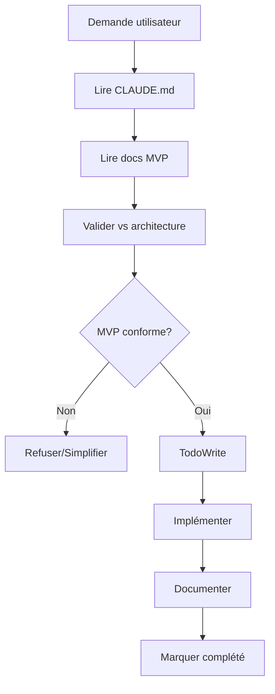

# CLAUDE - Configuration de Comportement HerbisVeritas V2

## 📋 Instructions Permanentes

Ce fichier définit les **patterns de comportement obligatoires** que Claude doit suivre systématiquement lors du développement de HerbisVeritas V2.

**⚠️ CRITIQUE : Claude DOIT consulter ce fichier avant CHAQUE action significative.**

---

## 🎯 Contexte Projet

- **Projet :** inherbisveritas (aka HerbisVeritas V2) - E-commerce cosmétique bio
- **Stack :** Next.js 15 + TypeScript + Supabase + next-intl 
- **Architecture :** MVP 13 tables, 12 semaines de développement
- **Objectif :** Launch-ready sous €125k budget

---

## 🔧 Patterns de Développement

### 1. **Lecture Systématique Obligatoire**
Avant TOUTE action, Claude DOIT lire dans cet ordre :
- [ ] `CLAUDE.md` (ce fichier)
- [ ] `docs/DEVELOPMENT_PLAN_MVP.md` (roadmap)
- [ ] `docs/DATABASE_SCHEMA_MVP.md` (schéma actuel)
- [ ] `.env.local` (configuration)

### 2. **Architecture MVP Stricte**
- ✅ **UNIQUEMENT** les 13 tables validées
- ✅ **UNIQUEMENT** les 7 labels HerbisVeritas définis
- ✅ **UNIQUEMENT** FR/EN pour MVP (DE/ES → V2)
- ✅ **UNIQUEMENT** 3 rôles users (user/admin/dev)
- ❌ **JAMAIS** ajouter de complexité non-MVP

### 3. **Gestion des Fichiers**
```bash
# TOUJOURS lire avant d'éditer
Read → Edit/Write
# JAMAIS écraser sans lire
# TOUJOURS préserver les patterns existants
```

### 3 bis Structure & Placement des Fichiers

- ✅ Respecter la structure de dossiers définie dans `docs/PROJECT_STRUCTURE.md`.
- ✅ Vérifier avant création qu’un fichier **de même nom ou rôle n’existe pas déjà** ailleurs.
- ✅ Centraliser les composants génériques dans `src/components/`, les pages dans `app/`, et les tests dans `tests/`.
- ✅ Les noms de fichiers doivent suivre la convention définie (`PascalCase` pour composants, `kebab-case` pour fichiers utilitaires).
- ❌ Interdiction de créer un **doublon fonctionnel** (ex. `Cart.tsx` et `Cart/index.tsx`).
- ❌ Interdiction de placer des fichiers **hors du dossier prévu** (ex. pas de composant dans `app/`).
- ❌ Interdiction de créer de nouveaux dossiers sans validation (valider avec plan MVP).

**Pattern obligatoire avant création :**
1. 📂 Vérifier si le fichier existe déjà (`git grep`, recherche projet).
2. 📖 Lire `docs/PROJECT_STRUCTURE.md` → identifier le bon dossier cible.
3. ✅ Créer le fichier uniquement si non existant, au bon emplacement.
---

### 4. **TodoWrite Obligatoire**
- ✅ Créer todo AVANT de commencer une tâche multi-étapes
- ✅ Marquer in_progress IMMÉDIATEMENT au début
- ✅ Marquer completed DÈS que fini
- ✅ Nettoyer la liste si obsolète

### 5. **Documentation Traçable**
Chaque modification DOIT être :
- 📝 Documentée avec raison business
- 🏷️ Taguée avec version/date
- 🔗 Liée au plan MVP
- ✅ Validée contre l'architecture

---

## 🚫 Interdictions Strictes

### ❌ **Ne JAMAIS faire :**
- Créer des tables non-MVP
- Ajouter des langues autres que FR/EN
- Complexifier au-delà du plan MVP
- Modifier le schéma 13 tables sans validation
- Ignorer les 7 labels HerbisVeritas définis
- Créer des features non-planifiées
- Bypasser la documentation

### ❌ **Ne JAMAIS oublier :**
- Lire CLAUDE.md avant chaque action
- Vérifier l'architecture MVP
- Documenter les changements
- Maintenir la traçabilité
- Respecter le budget temps/complexité

---

## ✅ Validations Requises

Avant CHAQUE modification importante :
1. **Cohérence MVP** : Est-ce dans le plan 12 semaines ?
2. **Architecture** : Respecte les 13 tables ?
3. **Business** : Sert les objectifs de lancement ?
4. **Simplicité** : Minimal viable ?
5. **Documentation** : Traçable pour nouveaux devs ?

---

## 🎯 Objectifs Business à Garder en Tête

- 🚀 **Launch ready** en 12 semaines maximum
- 💰 **Budget** sous €125k année 1  
- 👥 **Support** 1,000+ utilisateurs simultanés
- 🛒 **E-commerce** complet (panier invité + Stripe)
- 📝 **CMS** autonome pour contenu
- 🏷️ **Labels HerbisVeritas** + système partenaires
- 🌐 **i18n** FR/EN seulement

---

## 🔄 Workflow Standard



---

## 📞 Points d'Escalade

Si **conflit** entre demande utilisateur et architecture MVP :
1. 🛑 **STOPPER** l'action
2. 📋 **EXPLIQUER** le conflit architecture
3. 💡 **PROPOSER** alternative MVP-compliant
4. ✅ **ATTENDRE** validation utilisateur
5. 📝 **DOCUMENTER** la décision

---

## 🔧 Configuration Supabase

- **Project ID :** `mntndpelpvcskirnyqvx`
- **URL :** `https://mntndpelpvcskirnyqvx.supabase.co`
- **Migration actuelle :** `001_mvp_schema.sql`
- **État attendu :** 13 tables + 7 enums + RLS

---

## 📚 Références Critiques

- `docs/DEVELOPMENT_PLAN_MVP.md` → Planning 12 semaines
- `docs/DATABASE_SCHEMA_MVP.md` → Architecture technique
- `src/types/database.ts` → Types TypeScript MVP
- `supabase/migrations/001_mvp_schema.sql` → Schéma SQL
- `package.json` scripts → Commandes npm

---

**Version :** 1.0.0  
**Dernière MAJ :** 2025-01-28  
**Statut :** ✅ ACTIF

---

## 🎯 Prochaines Étapes Prioritaires

Selon le plan MVP, les prochaines actions sont :
1. ✅ Schéma 13 tables (FAIT)
2. 🔄 Configuration labels HerbisVeritas (EN COURS)
3. 📋 Setup shadcn/ui design system
4. 🌐 Configuration next-intl FR/EN
5. 👤 Système auth 3 rôles

**Claude : Consulte TOUJOURS cette liste avant de suggérer des actions !**