# CLAUDE - Configuration de Comportement HerbisVeritas V2

## 📋 Instructions Permanentes

Ce fichier définit les **patterns de comportement obligatoires** que Claude doit suivre systématiquement lors du développement de HerbisVeritas V2.

**⚠️ CRITIQUE : Claude DOIT consulter ce fichier avant CHAQUE action significative.**

---

## 🎯 Contexte Projet

- **Projet :** inherbisveritas (aka HerbisVeritas V2) - E-commerce cosmétique bio
- **Stack :** Next.js 15 + TypeScript + Supabase + next-intl 
- **Architecture :** MVP 13 tables, 12 semaines de développement
- **Objectif :** Launch-ready sous €125k budget

---

## 🔧 Patterns de Développement

### 1. **Lecture Systématique Obligatoire**
Avant TOUTE action, Claude DOIT lire dans cet ordre :
- [ ] `CLAUDE.md` (ce fichier)
- [ ] `docs/DEVELOPMENT_PLAN_MVP.md` (roadmap)
- [ ] `docs/DATABASE_SCHEMA_MVP.md` (schéma actuel)
- [ ] `.env.local` (configuration)

### 2. **Architecture MVP Stricte**
- ✅ **UNIQUEMENT** les 13 tables validées
- ✅ **UNIQUEMENT** les 7 labels HerbisVeritas définis
- ✅ **UNIQUEMENT** FR/EN pour MVP (DE/ES → V2)
- ✅ **UNIQUEMENT** 3 rôles users (user/admin/dev)
- ❌ **JAMAIS** ajouter de complexité non-MVP

### 3. **Gestion des Fichiers**
```bash
# TOUJOURS lire avant d'éditer
Read → Edit/Write
# JAMAIS écraser sans lire
# TOUJOURS préserver les patterns existants
```

### 3 bis Structure & Placement des Fichiers

- ✅ Respecter la structure de dossiers définie dans `docs/PROJECT_STRUCTURE.md`.
- ✅ Vérifier avant création qu'un fichier **de même nom ou rôle n'existe pas déjà** ailleurs.
- ✅ Centraliser les composants génériques dans `src/components/`, les pages dans `app/`, et les tests dans `tests/`.
- ✅ Les noms de fichiers doivent suivre la convention définie (`PascalCase` pour composants, `kebab-case` pour fichiers utilitaires).
- ❌ Interdiction de créer un **doublon fonctionnel** (ex. `Cart.tsx` et `Cart/index.tsx`).

### 4. **Conventions Nommage Next.js (DEV.TO Best Practices)**

**Règles Strictes Basées sur Standards Industrie :**

#### **Fichiers & Dossiers :**
- ✅ **kebab-case** pour TOUS les fichiers et dossiers (`user-profile.tsx`, `data-table.tsx`)
- ✅ **Consistance absolue** → JAMAIS mélanger les conventions
- ✅ **Compatibilité cross-platform** → Windows/Linux/macOS
- ✅ **URL-friendly** structure pour SEO et navigation

#### **Composants React :**
- ✅ **PascalCase** pour noms composants (`function UserProfile()`, `const DataTable`)
- ✅ **Alignement** nom composant ↔ nom fichier (`user-profile.tsx` → `UserProfile`)
- ✅ **Descriptif** et business-oriented

#### **Structure Dossiers UI :**
```bash
src/components/
├── ui/                    # kebab-case (shadcn/ui standard)
│   ├── button.tsx         # kebab-case fichiers
│   ├── input.tsx         # PascalCase composants
│   └── data-table.tsx    # aligné avec DataTable component
├── features/             # modules métier kebab-case
│   ├── user-profile.tsx  
│   └── product-catalog.tsx
```

#### **Interdictions Absolues :**
- ❌ **Doublons casse** : `ui/` ET `UI/` (Git Windows conflict)
- ❌ **Mix conventions** : `UserProfile.tsx` + `data-table.tsx` dans même dossier
- ❌ **PascalCase dossiers** : `Components/` → `components/`
- ❌ **Underscores** : `user_profile.tsx` → `user-profile.tsx`

#### **Validation Pre-Commit :**
```bash
# Vérifier absence doublons casse
find src/ -name "*" | sort | uniq -i -c | sort -nr | head -5
# Must return 1 per unique filename (case-insensitive)
```

**Source :** [Next.js Component Naming Best Practices](https://dev.to/vikasparmar/nextjs-component-naming-conventions-best-practices-for-file-and-component-names-39o2)
- ❌ Interdiction de placer des fichiers **hors du dossier prévu** (ex. pas de composant dans `app/`).
- ❌ Interdiction de créer de nouveaux dossiers sans validation (valider avec plan MVP).

**Pattern obligatoire avant création :**
1. 📂 Vérifier si le fichier existe déjà (`git grep`, recherche projet).
2. 📖 Lire `docs/PROJECT_STRUCTURE.md` → identifier le bon dossier cible.
3. ✅ Créer le fichier uniquement si non existant, au bon emplacement.
---

### 4. **TodoWrite Obligatoire**
- ✅ Créer todo AVANT de commencer une tâche multi-étapes
- ✅ Marquer in_progress IMMÉDIATEMENT au début
- ✅ Marquer completed DÈS que fini
- ✅ Nettoyer la liste si obsolète

### 5. **Documentation Traçable**
Chaque modification DOIT être :
- 📝 Documentée avec raison business
- 🏷️ Taguée avec version/date
- 🔗 Liée au plan MVP
- ✅ Validée contre l'architecture

### 6. **Règles de Commit Strictes**
Format obligatoire : Conventional Commits en français
```bash
type(scope): description concise

# Exemples valides :
feat(auth): ajout système 3 rôles utilisateur
fix(cart): correction calcul total panier invité  
docs(schema): mise à jour architecture 13 tables
refactor(products): optimisation requêtes Supabase
```

**Interdictions commits :**
- ❌ Emojis/émoticons (🚀, ✅, etc.)
- ❌ Signatures Claude automatiques  
- ❌ Messages anglais
- ❌ Descriptions verbeuses

**Pattern obligatoire avant commit :**
1. 📋 Interroger développeur sur mise à jour documentation requise
2. 📋 C:\inherbisveritas\doc est le dossier de la documentation définitive
3. 📋 C:\inherbisveritas\docs est le dossier de la documentation temporaire
4. ✅ Valider cohérence avec plan MVP  
5. 🔍 Message concis décrivant uniquement les changements

### 7. **Règles de Documentation**
**Style obligatoire :**
- ✅ Ton neutre, purement descriptif
- ✅ Langage technique précis
- ✅ Structure logique avec sections claires
- ❌ Emphase excessive (gras/italique abusif)  
- ❌ Emojis/émoticons
- ❌ Formulation marketing/commerciale

**Validation documentation :**
- Chaque nouveau fichier .md doit être approuvé explicitement
- Documentation existante : modification seulement si demandée
- Interroger sur opportunité mise à jour avant chaque commit

---

## 🚫 Interdictions Strictes

### ❌ **Ne JAMAIS faire :**
- Créer des tables non-MVP
- Ajouter des langues autres que FR/EN
- Complexifier au-delà du plan MVP
- Modifier le schéma 13 tables sans validation
- Ignorer les 7 labels HerbisVeritas définis
- Créer des features non-planifiées
- Bypasser la documentation

### ❌ **Ne JAMAIS oublier :**
- Lire CLAUDE.md avant chaque action
- Vérifier l'architecture MVP
- Documenter les changements
- Maintenir la traçabilité
- Respecter le budget temps/complexité

---

## ✅ Validations Requises

Avant CHAQUE modification importante :
1. **Cohérence MVP** : Est-ce dans le plan 12 semaines ?
2. **Architecture** : Respecte les 13 tables ?
3. **Business** : Sert les objectifs de lancement ?
4. **Simplicité** : Minimal viable ?
5. **Documentation** : Traçable pour nouveaux devs ?

---

## 🎯 Objectifs Business à Garder en Tête

- 🚀 **Launch ready** en 12 semaines maximum
- 💰 **Budget** sous €125k année 1  
- 👥 **Support** 1,000+ utilisateurs simultanés
- 🛒 **E-commerce** complet (panier invité + Stripe)
- 📝 **CMS** autonome pour contenu
- 🏷️ **Labels HerbisVeritas** + système partenaires
- 🌐 **i18n** FR/EN seulement

---

## 8. **Frontière Client/Serveur Next.js 15**

### Règles Obligatoires
Éviter fuites de secrets, erreurs d'hydratation, bloat du bundle et bugs de runtime en respectant strictement la séparation Client/Serveur Next.js 15 App Router.

#### **Choix du type de composant**
- ✅ **Par défaut Server Components** - Passer en Client uniquement si interactivité/hooks/APIs navigateur nécessaires
- ✅ **"use client"** entraîne tout son graphe d'imports côté client → attention imports involontaires
- ✅ **Network Boundary** : data + rendu serveur, micro-interactions client

#### **Secrets & code serveur uniquement**
- ✅ Taguer modules sensibles avec `import "server-only"` en tête → casse build si import côté client
- ❌ **JAMAIS** exposer variables d'env avec `NEXT_PUBLIC_` si sensibles → inlinées dans bundle
- ✅ SDK serveur (Stripe Node, ORM, fs) → `server-only` obligatoire

#### **Sérialisation Server → Client**
- ✅ **Uniquement objets JSON sérialisables** en props vers Client Components
- ❌ **JAMAIS** classes, fonctions, Dates non sérialisées entre Server/Client

#### **Hydratation & logique client-only**
- ❌ **Aucun accès** window/localStorage/Date.now() pendant render serveur
- ✅ **Déplacer dans useEffect** ou isoler via client component
- ✅ Contenu volontairement différent client/serveur → déférer au montage

#### **Imports et bundle**
- ❌ **Éviter** import libs lourdes/serveur depuis modules client → grossit bundle
- ✅ **dynamic(() => import(...), { ssr: false })** uniquement pour strict client-only
- ✅ **Runtime Node.js** par défaut, Edge réservé cas adaptés

#### **Data fetching & cache**
- ✅ **Server Components** : fetch/ORM côté serveur avec `cache: 'no-store'` ou `next: { revalidate: N }`
- ❌ **Éviter double fetch** SSR puis refetch client si non nécessaire

### Checklist Pré-Commit Client/Serveur
- [ ] Composants serveur par défaut, chaque "use client" justifié
- [ ] Aucun secret/SDK serveur/fs/ORM importé en client (`server-only` sur helpers sensibles)
- [ ] Props Server→Client sérialisables (pas classes/fonctions/Date brutes)
- [ ] Pas d'accès window/localStorage au render serveur
- [ ] `NEXT_PUBLIC_*` uniquement variables réellement publiques
- [ ] Pas de double fetch inutile serveur/client

---

## 🔄 Workflow Standard

```mermaid
graph TD
    A[Demande utilisateur] --> B[Lire CLAUDE.md]
    B --> C[Lire docs MVP]
    C --> D[Valider vs architecture]
    D --> E{MVP conforme?}
    E -->|Non| F[Refuser/Simplifier]
    E -->|Oui| G[TodoWrite]
    G --> H[Implémenter]
    H --> I[Documenter]
    I --> J[Marquer complété]
```



---

## 📞 Points d'Escalade

Si **conflit** entre demande utilisateur et architecture MVP :
1. 🛑 **STOPPER** l'action
2. 📋 **EXPLIQUER** le conflit architecture
3. 💡 **PROPOSER** alternative MVP-compliant
4. ✅ **ATTENDRE** validation utilisateur
5. 📝 **DOCUMENTER** la décision

---

## 🔧 Configuration Supabase

- **Project ID :** `mntndpelpvcskirnyqvx`
- **URL :** `https://mntndpelpvcskirnyqvx.supabase.co`
- **Migration actuelle :** `001_mvp_schema.sql`
- **État attendu :** 13 tables + 7 enums + RLS

---

## 📚 Références Critiques

- `docs/DEVELOPMENT_PLAN_MVP.md` → Planning 12 semaines
- `docs/DATABASE_SCHEMA_MVP.md` → Architecture technique
- `src/types/database.ts` → Types TypeScript MVP
- `supabase/migrations/001_mvp_schema.sql` → Schéma SQL
- `package.json` scripts → Commandes npm

---

**Version :** 1.0.0  
**Dernière MAJ :** 2025-01-28  
**Statut :** ✅ ACTIF

---

## 🎯 Prochaines Étapes Prioritaires

Selon le plan MVP, les prochaines actions sont :
1. ✅ Schéma 13 tables (FAIT)
2. 🔄 Configuration labels HerbisVeritas (EN COURS)
3. 📋 Setup shadcn/ui design system
4. 🌐 Configuration next-intl FR/EN
5. 👤 Système auth 3 rôles

**Claude : Consulte TOUJOURS cette liste avant de suggérer des actions !**