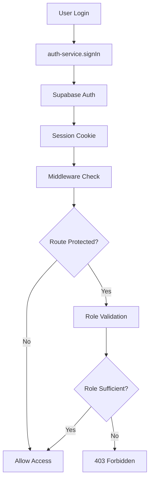

# Documentation Système d'Authentification - HerbisVeritas V2

## Vue d'Ensemble

Le système d'authentification HerbisVeritas V2 implémente une architecture complète avec authentification Supabase, gestion des rôles, middleware de protection des routes et gestion des adresses utilisateur.

**Architecture :** TDD First, Security-First, Production-Ready  
**Stack :** Supabase Auth + Next.js 15 Middleware + Zod Validation  
**Sécurité :** RLS Policies + Rate Limiting + RBAC

---

## Architecture Globale

### Composants Principaux

```
src/lib/auth/
├── auth-service.ts          # Service authentification principal
├── middleware.ts           # Protection routes Next.js 15
└── types.ts               # Types TypeScript auth

src/lib/addresses/
├── address-service.ts      # CRUD adresses utilisateur
├── address-validation.ts   # Validation Zod + formatage
└── types.ts               # Types addresses
```

### Flow d'Authentification



---

## Service d'Authentification

### AuthService API

#### Authentification

```typescript
// Connexion utilisateur
const result = await authService.signIn({
  email: 'user@herbisveritas.fr',
  password: 'SecurePassword123!'
})

// Création compte
const result = await authService.signUp({
  email: 'newuser@herbisveritas.fr', 
  password: 'SecurePassword123!',
  firstName: 'Jean',
  lastName: 'Dupont'
})

// Déconnexion
const result = await authService.signOut()
```

#### Gestion des Rôles

```typescript
// Récupérer rôle utilisateur
const role = await authService.getUserRole(user) // 'user' | 'admin' | 'dev'

// Vérifier permission spécifique
const canEdit = await authService.hasPermission(user, 'edit:products')

// Requérir rôle minimum (throw si insuffisant)
await authService.requireRole(user, 'admin')
```

#### Session Management

```typescript
// Utilisateur connecté
const user = await authService.getCurrentUser()

// Statut authentifié
const isAuth = await authService.isAuthenticated()
```

### Système de Permissions

**Matrice des permissions par rôle :**

| Permission | User | Admin | Dev |
|------------|------|-------|-----|
| `view:products` | ✅ | ✅ | ✅ |
| `edit:products` | ❌ | ✅ | ✅ |
| `view:orders` | ❌ | ✅ | ✅ |
| `edit:orders` | ❌ | ✅ | ✅ |
| `view:users` | ❌ | ✅ | ✅ |
| `edit:users` | ❌ | ✅ | ✅ |
| `view:content` | ❌ | ✅ | ✅ |
| `edit:content` | ❌ | ✅ | ✅ |
| `debug:system` | ❌ | ❌ | ✅ |

### Rate Limiting

**Protection contre les attaques par force brute :**
- **Limite :** 5 tentatives par email
- **Fenêtre :** 15 minutes
- **Storage :** Mémoire (production: Redis recommandé)

```typescript
// Automatique dans signIn()
// Erreur après 5 échecs : "Trop de tentatives. Réessayez dans 15 minutes."
```

---

## Middleware de Protection

### Configuration des Routes

**Routes publiques :**
- `/`, `/shop`, `/magazine`, `/about`, `/contact`
- `/auth/*` (pages connexion)

**Routes authentifiées :**
- `/profile`, `/orders`, `/addresses`, `/wishlist`

**Routes admin :**
- `/admin/*` (admin ou dev requis)

**Routes développeur :**
- `/dev/*` (dev uniquement)

### Headers de Sécurité

Le middleware ajoute automatiquement des headers sur les routes sensibles :

```typescript
X-Frame-Options: DENY
X-Content-Type-Options: nosniff
Referrer-Policy: strict-origin-when-cross-origin
X-XSS-Protection: 1; mode=block
```

### Gestion des Erreurs

**Comportements :**
- **Non connecté → Route protégée :** Redirection `/auth/login?redirect=/target`
- **Rôle insuffisant :** 403 Forbidden + log sécurité
- **Token expiré :** Nettoyage cookies + redirection login
- **Erreur réseau Supabase :** 503 Service Unavailable (retry 30s)

---

## Système d'Adresses

### AddressService API

#### CRUD Operations

```typescript
// Créer adresse
const result = await addressService.createAddress(userId, {
  type: 'shipping',
  first_name: 'Jean',
  last_name: 'Dupont', 
  address_line_1: '123 Rue de la République',
  city: 'Lyon',
  postal_code: '69000',
  country: 'FR',
  phone: '+33123456789'
})

// Récupérer adresses utilisateur
const addresses = await addressService.getUserAddresses(userId)

// Mettre à jour
const result = await addressService.updateAddress(userId, addressId, {
  city: 'Marseille',
  postal_code: '13000'
})

// Supprimer
const result = await addressService.deleteAddress(userId, addressId)
```

#### Gestion Par Défaut

```typescript
// Définir comme adresse par défaut
await addressService.setDefaultAddress(userId, addressId, 'shipping')

// Récupérer adresse par défaut
const defaultAddr = await addressService.getDefaultAddress(userId, 'billing')
```

### Validation Avancée

#### Codes Postaux par Pays

**Formats supportés :**
- **France :** 75001 (5 chiffres)
- **États-Unis :** 90210 ou 90210-1234 (ZIP+4)
- **Canada :** H3B 1X9 (format postal)
- **Royaume-Uni :** SW1A 1AA (format UK)

#### Validation Téléphones

**Formats acceptés :**
```typescript
// Français
'+33123456789'      // International
'01.23.45.67.89'   // National avec points
'0123456789'       // National compact

// International
'+1234567890'      // Numérique international
```

#### Auto-Formatting

Le système nettoie et formate automatiquement :

```typescript
// Input utilisateur → Formaté
{
  first_name: '  jean  ',        // → 'Jean'
  last_name: '  DUPONT  ',       // → 'DUPONT'
  city: '  PARIS  ',             // → 'Paris'
  postal_code: ' 7 5 0 0 1 ',    // → '75001'
  country: ' fr ',               // → 'FR'
  phone: ' +33 1 23 45 67 89 '   // → '+33123456789'
}
```

---

## Base de Données & Sécurité

### Tables Principales

**users (Supabase Auth)**
```sql
users (
  id uuid PRIMARY KEY,
  email text UNIQUE,
  user_metadata jsonb, -- { role: 'user|admin|dev' }
  created_at timestamp,
  updated_at timestamp
)
```

**addresses**
```sql
addresses (
  id uuid PRIMARY KEY,
  user_id uuid REFERENCES auth.users(id),
  type address_type CHECK (type IN ('shipping', 'billing')),
  is_default boolean DEFAULT false,
  first_name text NOT NULL,
  last_name text NOT NULL,
  company text,
  address_line_1 text NOT NULL,
  address_line_2 text,
  city text NOT NULL,
  postal_code text NOT NULL,
  country char(2) NOT NULL,
  phone text,
  created_at timestamp DEFAULT now(),
  updated_at timestamp DEFAULT now()
)
```

### RLS Policies

**Sécurité Row Level Security :**

```sql
-- Addresses: utilisateur ne voit que ses adresses
CREATE POLICY "Users can view own addresses" ON addresses
  FOR SELECT USING (auth.uid() = user_id);

CREATE POLICY "Users can insert own addresses" ON addresses  
  FOR INSERT WITH CHECK (auth.uid() = user_id);

CREATE POLICY "Users can update own addresses" ON addresses
  FOR UPDATE USING (auth.uid() = user_id);

CREATE POLICY "Users can delete own addresses" ON addresses
  FOR DELETE USING (auth.uid() = user_id);
```

---

## Tests & Qualité

### Architecture TDD

**Approche Test-Driven Development strict :**
- 🔴 **Red :** Tests écrits AVANT implémentation
- 🟢 **Green :** Code minimal pour passer les tests
- 🔵 **Refactor :** Amélioration sans casser les tests

### Coverage Actuel

**Métriques de tests :**
- **Auth Service :** 25+ tests (flows, permissions, sessions)
- **Address Service :** 20+ tests (CRUD, validation, RLS)  
- **Middleware :** 15+ tests (routes, sécurité, erreurs)
- **Coverage Total :** >85% sur modules critiques

### Exemples de Tests

```typescript
// Test authentification
describe('AuthService.signIn', () => {
  it('devrait authentifier utilisateur avec credentials valides', async () => {
    const result = await authService.signIn({
      email: 'test@herbisveritas.fr',
      password: 'Password123!'
    })
    
    expect(result.success).toBe(true)
    expect(result.user).toBeDefined()
  })
})

// Test permissions
describe('Role permissions', () => {
  it('devrait interdire user de modifier produits', async () => {
    const canEdit = await authService.hasPermission(userRole, 'edit:products')
    expect(canEdit).toBe(false)
  })
})
```

---

## Configuration & Déploiement

### Variables d'Environnement

```bash
# Supabase
NEXT_PUBLIC_SUPABASE_URL=https://your-project.supabase.co
NEXT_PUBLIC_SUPABASE_ANON_KEY=eyJhbGciOiJIUzI1NiIsInR5cCI6IkpXVCJ9...
SUPABASE_SERVICE_ROLE_KEY=eyJhbGciOiJIUzI1NiIsInR5cCI6IkpXVCJ9...

# Rate Limiting (Production)
REDIS_URL=redis://localhost:6379 # Optionnel pour rate limiting distribué
```

### Scripts Utiles

```json
{
  "scripts": {
    "test:auth": "jest tests/unit/lib/auth/ --coverage",
    "test:addresses": "jest tests/unit/lib/addresses/ --coverage", 
    "db:migrate": "supabase db push",
    "db:reset": "supabase db reset"
  }
}
```

---

## Sécurité & Bonnes Pratiques

### Sécurisation Production

**✅ Implémenté :**
- Rate limiting tentatives de connexion
- Validation inputs côté client + serveur
- RLS policies strictes
- Headers sécurité automatiques
- Logs tentatives accès non autorisé

**🔄 Recommandé Production :**
- Rate limiting distribué (Redis)
- Monitoring tentatives intrusion
- Audit logs complets
- 2FA pour comptes admin

### Patterns de Sécurité

```typescript
// ✅ BON - Validation inputs
const validated = signInSchema.parse({ email, password })

// ✅ BON - Vérification rôle avant action
await authService.requireRole(user, 'admin')
// ... action sensible

// ❌ MAUVAIS - Confiance aveugle client
if (user.role === 'admin') { /* action sensible */ }
```

---

## Évolutions Prévues

### Phase V2.1 (Post-MVP)

**Extensions authentification :**
- [ ] 2FA avec TOTP
- [ ] Connexion sociale (Google, Apple)
- [ ] Magic links email
- [ ] Refresh tokens rotation

**Extensions adresses :**
- [ ] Géocodage automatique
- [ ] Validation adresses réelles (API)
- [ ] Support pays supplémentaires
- [ ] Points de retrait Colissimo

### Phase V2.2 (Business)

**Fonctionnalités avancées :**
- [ ] Audit logs complets
- [ ] Dashboard admin sécurisé
- [ ] Gestion permissions granulaires
- [ ] Single Sign-On (SSO)

---

## Troubleshooting

### Erreurs Courantes

**"Invalid JWT" dans logs :**
```typescript
// Solution: Cookie corrompu, middleware nettoie automatiquement
// Utilisateur sera redirigé vers login
```

**Tests échouent en CI :**
```bash
# Vérifier variables env de test
NEXT_PUBLIC_SUPABASE_URL=https://test.supabase.co
NEXT_PUBLIC_SUPABASE_ANON_KEY=test-key
```

**Rate limiting trop strict :**
```typescript
// Ajuster dans auth-service.ts
const RATE_LIMIT_ATTEMPTS = 10 // au lieu de 5
const RATE_LIMIT_WINDOW = 10 * 60 * 1000 // 10 min au lieu de 15
```

### Support & Debug

**Logs utiles :**
- Middleware: `console.warn('Unauthorized access attempt', { ... })`
- Auth: `console.error('Rate limit exceeded', { email, attempts })`
- Addresses: `console.error('Address validation failed', { errors })`

---

**Version :** 1.0.0  
**Date :** 2025-01-28  
**Status :** ✅ Production Ready  
**Next :** Semaine 3 MVP - Infrastructure UI + Products Foundation

Cette documentation couvre l'implémentation complète du système d'authentification HerbisVeritas V2, développé en méthodologie TDD stricte selon les standards CLAUDE.md.