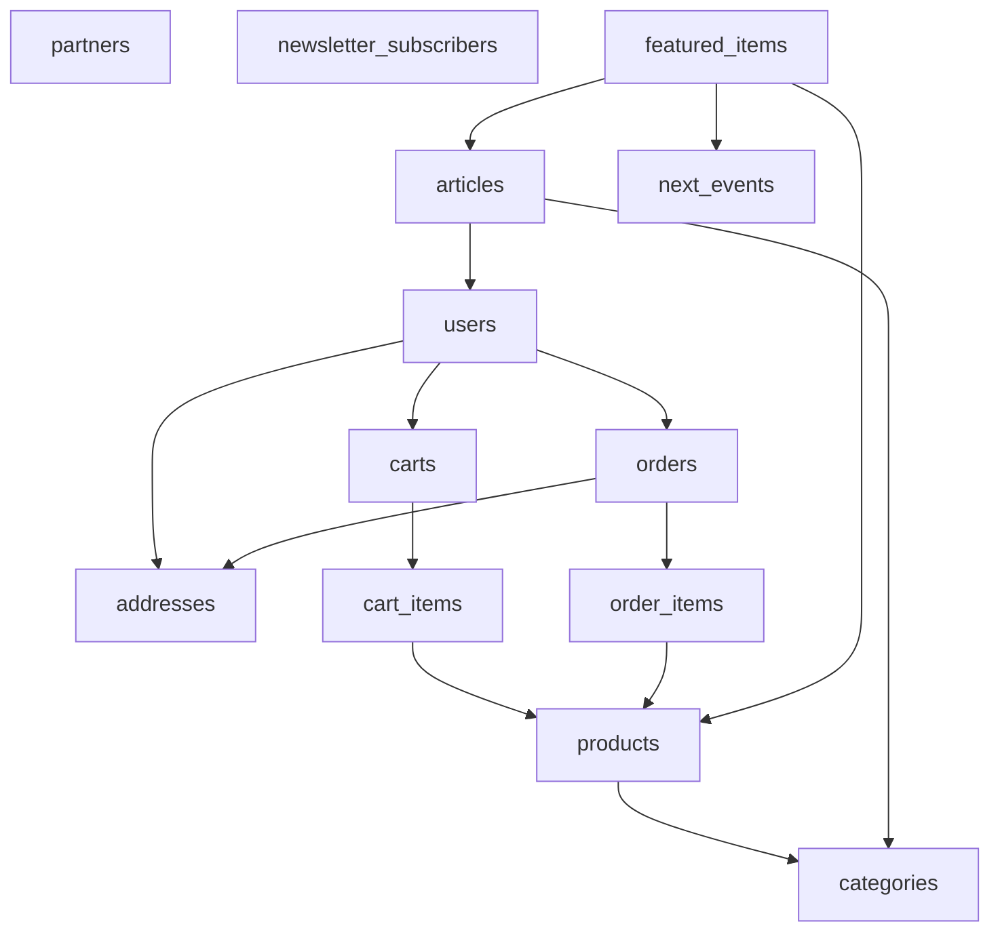

# HerbisVeritas V2 - Architecture Base de Données MVP

## 📋 Vue d'Ensemble

Cette documentation couvre le **schéma MVP à 13 tables essentielles** de la plateforme e-commerce HerbisVeritas V2, construite sur Supabase PostgreSQL.

**Architecture MVP validée** pour lancement avec fonctionnalités business critiques préservées.

La base de données supporte :
- 🌐 **Multilingue** - FR/EN via JSONB (DE/ES en V2)
- 👥 **Utilisateurs** - 3 rôles (user/admin/dev)
- 🛒 **E-commerce complet** - Panier invité, Stripe, tracking Colissimo
- 📰 **Magazine TipTap** - Éditeur riche, categories seulement
- 🏪 **Partenaires** - Points de vente avec réseaux sociaux
- 📅 **Événements** - Hero simple (pas calendrier complexe)

---

## 🏗️ Architecture MVP (13 Tables)

### Structure Validée



### Organisation par Modules MVP

**🔵 Core E-commerce (8 tables)**
- `users` - Profils utilisateurs (3 rôles)
- `addresses` - Table séparée moderne  
- `products` - Labels HerbisVeritas + i18n JSONB
- `categories` - Hiérarchique avec i18n JSONB
- `carts` + `cart_items` - Guest/User système
- `orders` + `order_items` - Stripe complet, 4 états

**🟢 Content & Marketing (5 tables)**
- `articles` - Magazine TipTap (pas analytics)
- `partners` - Points vente avec réseaux sociaux
- `next_events` - Événement Hero simple
- `newsletter_subscribers` - Basique (pas tracking RGPD)
- `featured_items` - Hero polyvalent produits/articles/événements

**❌ Tables reportées V2 :**
- `login_attempts` (sécurité avancée)
- `tags`, `article_tags` (système M:N → categories seules)
- `markets` (calendrier récurrence → `next_events` simple)
- `pickup_points`, `shipping_methods` (logistique → prix fixe Colissimo)
- `audit_logs`, `events` (monitoring avancé)
- `legal_documents` (CMS → pages statiques)

---

## 👥 UTILISATEURS & AUTHENTIFICATION

### **1. users** - Profils Utilisateurs (3 rôles MVP)

```sql
CREATE TABLE users (
  id UUID PRIMARY KEY REFERENCES auth.users(id),
  email TEXT UNIQUE NOT NULL,
  
  -- Identité
  first_name TEXT,
  last_name TEXT,
  phone_number TEXT,
  
  -- Rôles MVP (3 seulement)
  role user_role DEFAULT 'user',           -- user | admin | dev
  status TEXT DEFAULT 'active',
  
  -- Business
  newsletter_subscribed BOOLEAN DEFAULT false,
  terms_accepted_at TIMESTAMPTZ,
  last_activity TIMESTAMPTZ,
  
  created_at TIMESTAMPTZ DEFAULT NOW(),
  updated_at TIMESTAMPTZ DEFAULT NOW()
);

CREATE TYPE user_role AS ENUM ('user', 'admin', 'dev');
```

**🔒 Row Level Security :**
```sql
-- Users voient leur profil
CREATE POLICY "users_own_profile" ON users
  FOR ALL USING (auth.uid() = id);

-- Admins voient tout  
CREATE POLICY "users_admin_access" ON users
  FOR ALL USING (
    EXISTS (SELECT 1 FROM users WHERE id = auth.uid() AND role = 'admin')
  );
```

### **2. addresses** - Adresses Séparées (FK moderne)

```sql
CREATE TABLE addresses (
  id UUID PRIMARY KEY DEFAULT gen_random_uuid(),
  user_id UUID REFERENCES users(id) ON DELETE CASCADE,
  
  -- Type
  address_type address_type NOT NULL,     -- shipping | billing
  is_default BOOLEAN DEFAULT false,
  
  -- Informations
  first_name TEXT,
  last_name TEXT,
  company_name TEXT,
  
  -- Adresse
  street_number TEXT,
  address_line1 TEXT NOT NULL,
  address_line2 TEXT,
  city TEXT NOT NULL,
  postal_code TEXT NOT NULL,
  country_code TEXT DEFAULT 'FR',
  state_province_region TEXT,
  
  -- Contact
  phone_number TEXT,
  email TEXT,
  
  created_at TIMESTAMPTZ DEFAULT NOW(),
  updated_at TIMESTAMPTZ DEFAULT NOW()
);

CREATE TYPE address_type AS ENUM ('shipping', 'billing');

-- Une seule adresse par défaut par type
CREATE UNIQUE INDEX idx_addresses_default_shipping 
  ON addresses(user_id) WHERE address_type = 'shipping' AND is_default = true;
CREATE UNIQUE INDEX idx_addresses_default_billing 
  ON addresses(user_id) WHERE address_type = 'billing' AND is_default = true;
```

---

## 🛍️ CATALOGUE PRODUITS

### **3. categories** - Hiérarchique avec i18n JSONB

```sql
CREATE TABLE categories (
  id UUID PRIMARY KEY DEFAULT gen_random_uuid(),
  slug TEXT UNIQUE NOT NULL,
  parent_id UUID REFERENCES categories(id),
  
  -- Contenu français (défaut)
  name TEXT NOT NULL,
  description TEXT,
  color TEXT, -- Hex color (#FF5733)
  
  -- i18n JSONB (décision MVP)
  translations JSONB DEFAULT '{}',
  
  -- Gestion
  sort_order INTEGER DEFAULT 0,
  
  created_at TIMESTAMPTZ DEFAULT NOW(),
  updated_at TIMESTAMPTZ DEFAULT NOW()
);

-- Structure translations JSONB :
-- {
--   "en": {"name": "Soaps", "description": "Natural soaps"},
--   "de": {"name": "Seifen", "description": "Natürliche Seifen"}
-- }
```

### **4. products** - Cosmétique avec Labels HerbisVeritas

```sql
CREATE TABLE products (
  id UUID PRIMARY KEY DEFAULT gen_random_uuid(),
  slug TEXT UNIQUE NOT NULL,
  category_id UUID REFERENCES categories(id), -- FK corrigé !
  
  -- Informations de base (français)
  name TEXT NOT NULL,
  description_short TEXT,
  description_long TEXT,
  
  -- Commerce
  price DECIMAL(10,2) NOT NULL,
  currency TEXT DEFAULT 'EUR',
  stock INTEGER DEFAULT 0,
  unit TEXT DEFAULT 'pièce',
  
  -- Médias
  image_url TEXT,
  
  -- Spécificités cosmétique (CRITIQUE MVP)
  inci_list TEXT[], -- Liste ingrédients INCI (réglementation EU)
  labels product_label[] DEFAULT '{}', -- Labels HerbisVeritas
  
  -- États
  status TEXT DEFAULT 'active',
  is_active BOOLEAN DEFAULT true,
  is_new BOOLEAN DEFAULT false,
  -- is_on_promotion → V2
  
  -- i18n JSONB (cohérence avec categories)
  translations JSONB DEFAULT '{}',
  
  created_at TIMESTAMPTZ DEFAULT NOW(),
  updated_at TIMESTAMPTZ DEFAULT NOW()
);

-- Labels métier HerbisVeritas (décision finale)
CREATE TYPE product_label AS ENUM (
  'recolte_main',           -- "Récolté à la main"
  'bio',                    -- "Bio"
  'origine_occitanie',      -- "Origine Occitanie" 
  'partenariat_producteurs', -- "Partenariat producteurs locaux"
  'rituel_bien_etre',       -- "Rituel de bien-être"
  'rupture_recolte',        -- "Rupture de récolte"
  'essence_precieuse'       -- "Essence précieuse"
);

-- Index pour performances
CREATE INDEX idx_products_category ON products(category_id);
CREATE INDEX idx_products_labels ON products USING GIN(labels);
CREATE INDEX idx_products_active ON products(is_active) WHERE is_active = true;
```

---

## 🛒 PANIER & COMMANDES

### **5. carts** - Système Guest/User MVP

```sql
CREATE TABLE carts (
  id UUID PRIMARY KEY DEFAULT gen_random_uuid(),
  user_id UUID REFERENCES users(id), -- NULL si invité
  guest_id TEXT,                      -- Session invité (décision MVP)
  
  status TEXT DEFAULT 'active',       -- active | completed | abandoned
  metadata JSONB DEFAULT '{}',        -- Données flexibles
  
  created_at TIMESTAMPTZ DEFAULT NOW(),
  updated_at TIMESTAMPTZ DEFAULT NOW()
);

-- Index pour retrouver paniers guest/user
CREATE INDEX idx_carts_user ON carts(user_id) WHERE user_id IS NOT NULL;
CREATE INDEX idx_carts_guest ON carts(guest_id) WHERE guest_id IS NOT NULL;
```

### **6. cart_items** - Articles Panier

```sql
CREATE TABLE cart_items (
  id UUID PRIMARY KEY DEFAULT gen_random_uuid(),
  cart_id UUID REFERENCES carts(id) ON DELETE CASCADE,
  product_id UUID REFERENCES products(id) ON DELETE CASCADE,
  
  quantity INTEGER NOT NULL DEFAULT 1,
  
  added_at TIMESTAMPTZ DEFAULT NOW(),
  created_at TIMESTAMPTZ DEFAULT NOW(),
  updated_at TIMESTAMPTZ DEFAULT NOW()
);

CREATE INDEX idx_cart_items_cart ON cart_items(cart_id);
CREATE INDEX idx_cart_items_product ON cart_items(product_id);
```

### **7. orders** - Commandes avec Stripe Complet

```sql
CREATE TABLE orders (
  id UUID PRIMARY KEY DEFAULT gen_random_uuid(),
  order_number TEXT UNIQUE, -- Généré automatiquement
  user_id UUID REFERENCES users(id) NOT NULL,
  
  -- États MVP (4 états décision)
  status order_status DEFAULT 'pending_payment',
  payment_status payment_status DEFAULT 'pending',
  
  -- Montants
  total_amount DECIMAL(10,2) NOT NULL,
  currency TEXT DEFAULT 'EUR',
  shipping_fee DECIMAL(10,2) DEFAULT 4.90, -- Prix fixe Colissimo MVP
  
  -- Adresses
  shipping_address_id UUID REFERENCES addresses(id),
  billing_address_id UUID REFERENCES addresses(id),
  
  -- Stripe intégration complète (décision MVP)
  payment_method TEXT,
  payment_intent_id TEXT,
  stripe_checkout_session_id TEXT,
  stripe_checkout_id TEXT,
  
  -- Logistique basique
  shipping_method TEXT DEFAULT 'colissimo',
  tracking_number TEXT,
  tracking_url TEXT,
  
  -- Métadonnées
  notes TEXT,
  
  -- Timestamps logistiques
  created_at TIMESTAMPTZ DEFAULT NOW(),
  updated_at TIMESTAMPTZ DEFAULT NOW(),
  shipped_at TIMESTAMPTZ,
  delivered_at TIMESTAMPTZ
);

-- États MVP (4 états décision)
CREATE TYPE order_status AS ENUM (
  'pending_payment', -- En attente paiement
  'processing',      -- Préparation
  'shipped',         -- Expédiée
  'delivered'        -- Livrée
);

CREATE TYPE payment_status AS ENUM (
  'pending', 'succeeded', 'failed', 'refunded'
);

CREATE INDEX idx_orders_user ON orders(user_id);
CREATE INDEX idx_orders_status ON orders(status);
```

### **8. order_items** - Articles Commande avec Snapshot

```sql
CREATE TABLE order_items (
  id UUID PRIMARY KEY DEFAULT gen_random_uuid(),
  order_id UUID REFERENCES orders(id) ON DELETE CASCADE,
  product_id UUID REFERENCES products(id),
  
  -- Quantité et prix figés
  quantity INTEGER NOT NULL,
  price_at_purchase DECIMAL(10,2) NOT NULL,
  
  -- Snapshot produit (historique)
  product_name_at_purchase TEXT,
  product_image_url_at_purchase TEXT,
  product_sku_at_purchase TEXT,
  
  created_at TIMESTAMPTZ DEFAULT NOW(),
  updated_at TIMESTAMPTZ DEFAULT NOW()
);

CREATE INDEX idx_order_items_order ON order_items(order_id);
```

---

## 📰 CONTENU & MARKETING

### **9. articles** - Magazine TipTap

```sql
CREATE TABLE articles (
  id UUID PRIMARY KEY DEFAULT gen_random_uuid(),
  slug TEXT UNIQUE NOT NULL,
  author_id UUID REFERENCES users(id) NOT NULL,
  category_id UUID REFERENCES categories(id),
  
  -- Contenu français (défaut)
  title TEXT NOT NULL,
  excerpt TEXT,
  content JSONB NOT NULL,     -- TipTap JSON (décision MVP)
  content_html TEXT,          -- HTML généré
  
  -- Médias
  featured_image TEXT,
  
  -- États
  status TEXT DEFAULT 'draft', -- draft | published | archived
  published_at TIMESTAMPTZ,
  
  -- SEO
  seo_title TEXT,
  seo_description TEXT,
  
  -- i18n JSONB (cohérence architecture)
  translations JSONB DEFAULT '{}',
  
  created_at TIMESTAMPTZ DEFAULT NOW(),
  updated_at TIMESTAMPTZ DEFAULT NOW()
);

-- Index pour queries fréquentes
CREATE INDEX idx_articles_author ON articles(author_id);
CREATE INDEX idx_articles_category ON articles(category_id);
CREATE INDEX idx_articles_published ON articles(published_at DESC) 
  WHERE status = 'published';
```

### **10. partners** - Points de Vente avec Réseaux Sociaux

```sql
CREATE TABLE partners (
  id UUID PRIMARY KEY DEFAULT gen_random_uuid(),
  
  -- Informations boutique
  name TEXT NOT NULL,
  description TEXT NOT NULL,
  address TEXT NOT NULL,
  image_url TEXT NOT NULL,
  
  -- Réseaux sociaux (décision finale)
  facebook_url TEXT,
  instagram_url TEXT,
  
  -- Gestion page "Nous retrouver"
  display_order INTEGER DEFAULT 0,
  is_active BOOLEAN DEFAULT true,
  
  created_at TIMESTAMPTZ DEFAULT NOW(),
  updated_at TIMESTAMPTZ DEFAULT NOW()
);

CREATE INDEX idx_partners_active ON partners(display_order) WHERE is_active = true;
```

### **11. next_events** - Événement Hero Simple

```sql
CREATE TABLE next_events (
  id UUID PRIMARY KEY DEFAULT gen_random_uuid(),
  
  -- Informations événement
  title TEXT NOT NULL,
  description TEXT,
  date DATE NOT NULL,           -- "2025-02-15"
  time_start TIME NOT NULL,     -- "09:00"
  time_end TIME,                -- "17:00"
  location TEXT NOT NULL,
  
  -- Médias
  image_url TEXT,
  
  -- Gestion Hero homepage
  is_active BOOLEAN DEFAULT true,
  
  created_at TIMESTAMPTZ DEFAULT NOW(),
  updated_at TIMESTAMPTZ DEFAULT NOW()
);

-- Un seul événement actif à la fois
CREATE UNIQUE INDEX idx_next_events_active ON next_events(is_active) 
  WHERE is_active = true;
```

### **12. newsletter_subscribers** - Abonnements Basiques

```sql
CREATE TABLE newsletter_subscribers (
  id UUID PRIMARY KEY DEFAULT gen_random_uuid(),
  email TEXT UNIQUE NOT NULL,
  
  -- États
  is_active BOOLEAN DEFAULT true,
  subscribed_at TIMESTAMPTZ DEFAULT NOW(),
  
  -- Métadonnées basiques (pas tracking RGPD)
  source TEXT, -- "website" | "popup" | "checkout"
  
  created_at TIMESTAMPTZ DEFAULT NOW(),
  updated_at TIMESTAMPTZ DEFAULT NOW()
);

CREATE INDEX idx_newsletter_active ON newsletter_subscribers(email) 
  WHERE is_active = true;
```

### **13. featured_items** - Hero Polyvalent

```sql
CREATE TABLE featured_items (
  id UUID PRIMARY KEY DEFAULT gen_random_uuid(),
  
  -- Polyvalence Hero (décision finale)
  type featured_type NOT NULL,    -- product | article | event
  item_id UUID NOT NULL,          -- FK polymorphe
  
  -- Customisation affichage
  title_override TEXT,
  subtitle TEXT,
  image_override TEXT,
  
  -- Gestion
  is_active BOOLEAN DEFAULT true,
  display_order INTEGER DEFAULT 0,
  
  created_at TIMESTAMPTZ DEFAULT NOW(),
  updated_at TIMESTAMPTZ DEFAULT NOW()
);

CREATE TYPE featured_type AS ENUM ('product', 'article', 'event');

CREATE INDEX idx_featured_active ON featured_items(display_order) 
  WHERE is_active = true;
```

---

## 🔒 Sécurité Row Level Security (RLS)

### Policies MVP Principales

```sql
-- Products : Tous peuvent voir les actifs
ALTER TABLE products ENABLE ROW LEVEL SECURITY;
CREATE POLICY "products_public_view" ON products
  FOR SELECT USING (is_active = true);
CREATE POLICY "products_admin_all" ON products
  FOR ALL USING (
    EXISTS (SELECT 1 FROM users WHERE id = auth.uid() AND role = 'admin')
  );

-- Orders : Users voient leurs commandes
ALTER TABLE orders ENABLE ROW LEVEL SECURITY;
CREATE POLICY "orders_own" ON orders
  FOR ALL USING (user_id = auth.uid());
CREATE POLICY "orders_admin" ON orders
  FOR ALL USING (
    EXISTS (SELECT 1 FROM users WHERE id = auth.uid() AND role = 'admin')
  );

-- Articles : Tous peuvent voir les publiés
ALTER TABLE articles ENABLE ROW LEVEL SECURITY;
CREATE POLICY "articles_public" ON articles
  FOR SELECT USING (status = 'published');
CREATE POLICY "articles_admin" ON articles
  FOR ALL USING (
    EXISTS (SELECT 1 FROM users WHERE id = auth.uid() AND role = 'admin')
  );
```

---

## 📊 Index & Performances

### Index Critiques MVP

```sql
-- Recherche produits
CREATE INDEX idx_products_search ON products 
  USING gin(to_tsvector('french', name || ' ' || COALESCE(description_short, '')));

-- E-commerce fréquent
CREATE INDEX idx_orders_recent ON orders(created_at DESC);
CREATE INDEX idx_cart_items_product_cart ON cart_items(product_id, cart_id);

-- Content
CREATE INDEX idx_articles_search ON articles
  USING gin(to_tsvector('french', title || ' ' || COALESCE(excerpt, '')));
```

---

## 🚀 Migration & Déploiement

### Script Migration MVP

```sql
-- 1. Créer les types
CREATE TYPE user_role AS ENUM ('user', 'admin', 'dev');
CREATE TYPE address_type AS ENUM ('shipping', 'billing');
CREATE TYPE order_status AS ENUM ('pending_payment', 'processing', 'shipped', 'delivered');
CREATE TYPE payment_status AS ENUM ('pending', 'succeeded', 'failed', 'refunded');
CREATE TYPE product_label AS ENUM (
  'recolte_main', 'bio', 'origine_occitanie', 
  'partenariat_producteurs', 'rituel_bien_etre', 
  'rupture_recolte', 'essence_precieuse'
);
CREATE TYPE featured_type AS ENUM ('product', 'article', 'event');

-- 2. Créer toutes les tables dans l'ordre des dépendances
-- (users -> addresses -> categories -> products -> carts/orders -> content)

-- 3. Activer RLS sur toutes les tables
-- 4. Créer les policies
-- 5. Créer les index
-- 6. Insérer données initiales si besoin
```

Cette architecture MVP de 13 tables préserve toutes les fonctionnalités business essentielles tout en simplifiant la complexité pour un lancement rapide et maintenable.