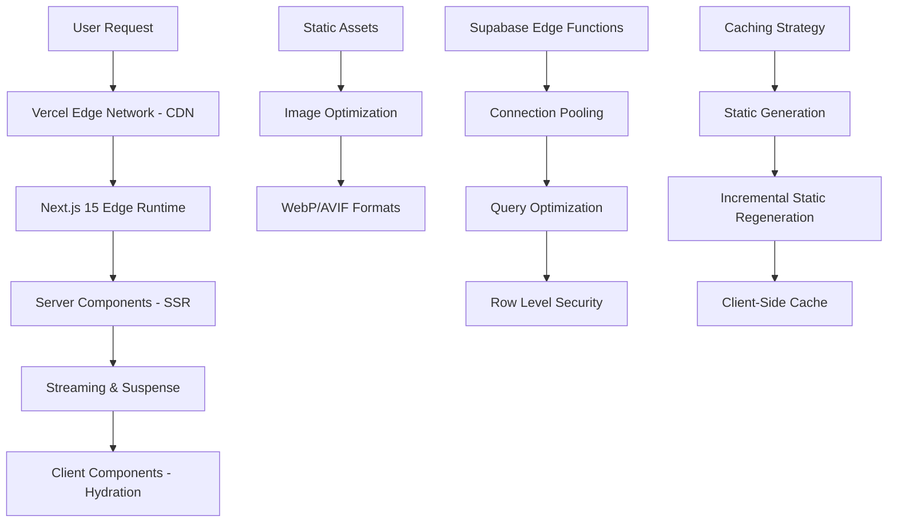

# Optimisation des Performances - HerbisVeritas V2 MVP

## ⚡ Vue d'Ensemble

Ce document détaille les stratégies d'optimisation des performances pour HerbisVeritas V2 MVP (13 tables), couvrant l'optimisation frontend (Next.js 15), backend (Supabase), et infrastructure (Vercel Edge Network) pour garantir des Core Web Vitals < 2s.

---

## 🎯 Objectifs de Performance

### Métriques Cibles (Core Web Vitals)

```typescript
// Performance targets selon Google Core Web Vitals
const PERFORMANCE_TARGETS = {
  // Largest Contentful Paint - Temps de chargement du contenu principal
  LCP: {
    target: 1.2, // secondes
    good: '< 2.5s',
    needsImprovement: '2.5s - 4.0s',
    poor: '> 4.0s'
  },
  
  // First Input Delay - Réactivité aux interactions utilisateur
  FID: {
    target: 50, // millisecondes
    good: '< 100ms',
    needsImprovement: '100ms - 300ms', 
    poor: '> 300ms'
  },
  
  // Cumulative Layout Shift - Stabilité visuelle
  CLS: {
    target: 0.05,
    good: '< 0.1',
    needsImprovement: '0.1 - 0.25',
    poor: '> 0.25'
  },
  
  // Interaction to Next Paint - Nouvelle métrique de réactivité
  INP: {
    target: 100, // millisecondes
    good: '< 200ms',
    needsImprovement: '200ms - 500ms',
    poor: '> 500ms'
  }
} as const

// Métriques techniques supplémentaires
const TECHNICAL_TARGETS = {
  // Time to First Byte - Performance serveur
  TTFB: 200, // ms
  
  // First Contentful Paint - Premier rendu
  FCP: 800, // ms
  
  // Total Blocking Time - Temps de blocage JS
  TBT: 150, // ms
  
  // Bundle sizes
  initialJS: 150, // KB
  totalJS: 500, // KB
  
  // Images
  imageOptimization: 85, // % WebP/AVIF usage
  lazyLoading: 95, // % images lazy-loaded
}
```

### Architecture de Performance



---

## 🚀 Optimisation Frontend (Next.js 15)

### Server Components et Streaming

```typescript
// app/products/page.tsx - Optimisation avec streaming
import { Suspense } from 'react'
import { ProductList } from '@/components/products/ProductList'
import { ProductFilters } from '@/components/products/ProductFilters'
import { ProductSkeleton } from '@/components/products/ProductSkeleton'

interface ProductPageProps {
  searchParams: Promise<{
    category?: string
    search?: string
    page?: string
  }>
}

export default async function ProductsPage({ searchParams }: ProductPageProps) {
  // Await searchParams selon Next.js 15
  const params = await searchParams
  
  return (
    <div className="container mx-auto px-4 py-8">
      {/* Chargement immédiat des filtres (statiques) */}
      <ProductFilters />
      
      {/* Streaming du contenu principal avec Suspense */}
      <Suspense 
        fallback={<ProductSkeleton count={12} />}
        key={`products-${params.category}-${params.search}-${params.page}`}
      >
        <ProductList searchParams={params} />
      </Suspense>
    </div>
  )
}

// Metadata optimized pour SEO et performance
export async function generateMetadata({ searchParams }: ProductPageProps) {
  const params = await searchParams
  
  return {
    title: params.category 
      ? `Produits ${params.category} - HerbisVeritas`
      : 'Produits Bio - HerbisVeritas',
    description: 'Découvrez notre sélection de produits biologiques locaux',
    // OpenGraph optimized
    openGraph: {
      title: 'Produits Bio - HerbisVeritas',
      description: 'Produits biologiques locaux de qualité',
      images: ['/og-products.jpg'],
    },
    // Performance hints
    other: {
      'preload': '/api/products',
    }
  }
}
```

### Optimisation des Composants avec React 19

```typescript
// components/products/ProductCard.tsx - Composant optimisé
import { memo, startTransition } from 'react'
import { useOptimistic } from 'react'
import Image from 'next/image'
import Link from 'next/link'
import { Price } from '@/components/ui/price'
import { AddToCartButton } from '@/components/cart/AddToCartButton'
import { type Product } from '@/types/supabase'

interface ProductCardProps {
  product: Product
  priority?: boolean
}

// Memoization avec comparaison shallow
export const ProductCard = memo(function ProductCard({ 
  product, 
  priority = false 
}: ProductCardProps) {
  
  // Optimistic UI pour l'ajout au panier
  const [optimisticInCart, addOptimisticToCart] = useOptimistic(
    false,
    (state, action: 'add' | 'remove') => action === 'add'
  )
  
  const handleAddToCart = async () => {
    // Transition non-bloquante
    startTransition(() => {
      addOptimisticToCart('add')
    })
    
    // Action serveur asynchrone
    try {
      await addToCart(product.id)
    } catch (error) {
      // Revert optimistic update
      startTransition(() => {
        addOptimisticToCart('remove')
      })
      throw error
    }
  }
  
  return (
    <div className="product-card group relative overflow-hidden rounded-lg border bg-white shadow-sm transition-all hover:shadow-md hover:-translate-y-1">
      {/* Image optimisée avec Next.js */}
      <div className="aspect-square relative overflow-hidden">
        <Image
          src={product.image_url || '/placeholder-product.jpg'}
          alt={product.name}
          fill
          priority={priority} // Priorité pour images above-the-fold
          sizes="(max-width: 768px) 50vw, (max-width: 1200px) 33vw, 25vw"
          className="object-cover transition-transform group-hover:scale-105"
          placeholder="blur"
          blurDataURL="data:image/jpeg;base64,/9j/4AAQSkZJRgABAQAAAQABAAD/2wBDAAYEBQYFBAYGBQYHBwYIChAKCgkJChQODwwQFxQYGBcUFhYaHSUfGhsjHBYWICwgIyYnKSopGR8tMC0oMCUoKSj/2wBDAQcHBwoIChMKChMoGhYaKCgoKCgoKCgoKCgoKCgoKCgoKCgoKCgoKCgoKCgoKCgoKCgoKCgoKCgoKCgoKCgoKCj/wAARCAABAAEDASIAAhEBAxEB/8QAFQABAQAAAAAAAAAAAAAAAAAAAAv/xAAUEAEAAAAAAAAAAAAAAAAAAAAA/8QAFQEBAQAAAAAAAAAAAAAAAAAAAAX/xAAUEQEAAAAAAAAAAAAAAAAAAAAA/9oADAMBAAIRAxEAPwCdABmX/9k="
        />
        
        {/* Badge de statut */}
        {product.stock <= 5 && product.stock > 0 && (
          <div className="absolute top-2 right-2 rounded bg-orange-100 px-2 py-1 text-xs font-medium text-orange-800">
            Stock limité
          </div>
        )}
        
        {product.stock === 0 && (
          <div className="absolute inset-0 bg-gray-900/50 flex items-center justify-center">
            <span className="bg-white px-4 py-2 rounded-lg font-medium text-gray-900">
              Épuisé
            </span>
          </div>
        )}
      </div>
      
      <div className="p-4">
        {/* Titre avec Link optimisé */}
        <Link 
          href={`/products/${product.slug}`}
          className="block hover:underline"
          prefetch={false} // Pas de prefetch pour économiser la bande passante
        >
          <h3 className="font-semibold text-gray-900 line-clamp-2">
            {product.name}
          </h3>
        </Link>
        
        {/* Description tronquée */}
        <p className="mt-2 text-sm text-gray-600 line-clamp-2">
          {product.description}
        </p>
        
        {/* Prix et actions */}
        <div className="mt-4 flex items-center justify-between">
          <Price 
            value={product.price} 
            size="lg"
            variant="accent"
          />
          
          <AddToCartButton
            product={product}
            onAddToCart={handleAddToCart}
            disabled={product.stock === 0}
            optimisticState={optimisticInCart}
          />
        </div>
      </div>
    </div>
  )
}, (prevProps, nextProps) => {
  // Comparaison personnalisée pour éviter les re-renders inutiles
  return (
    prevProps.product.id === nextProps.product.id &&
    prevProps.product.stock === nextProps.product.stock &&
    prevProps.product.price === nextProps.product.price &&
    prevProps.priority === nextProps.priority
  )
})

ProductCard.displayName = 'ProductCard'
```

### Optimisation des Images et Assets

```typescript
// lib/image-optimization.ts
import { ImageProps } from 'next/image'

/**
 * Configuration optimisée pour les images Next.js
 */
export const IMAGE_CONFIG = {
  // Formats supportés par ordre de préférence
  formats: ['image/avif', 'image/webp', 'image/jpeg'],
  
  // Tailles responsive prédéfinies
  sizes: {
    // Grille de produits
    productGrid: '(max-width: 768px) 50vw, (max-width: 1200px) 33vw, 25vw',
    
    // Image hero
    hero: '100vw',
    
    // Détail produit
    productDetail: '(max-width: 768px) 100vw, 50vw',
    
    // Avatar utilisateur
    avatar: '64px',
    
    // Logo
    logo: '200px'
  },
  
  // Qualité par contexte
  quality: {
    hero: 85,
    product: 80,
    thumbnail: 75,
    avatar: 70
  }
} as const

/**
 * Générateur de props Image optimisées
 */
export function getOptimizedImageProps(
  src: string,
  context: keyof typeof IMAGE_CONFIG.sizes,
  options: {
    alt: string
    priority?: boolean
    className?: string
  }
): ImageProps {
  return {
    src,
    alt: options.alt,
    fill: true,
    sizes: IMAGE_CONFIG.sizes[context],
    quality: IMAGE_CONFIG.quality[context as keyof typeof IMAGE_CONFIG.quality] || 80,
    priority: options.priority || false,
    className: options.className,
    placeholder: 'blur',
    blurDataURL: generateBlurDataURL(),
  }
}

/**
 * Génération de placeholder blur optimisé
 */
function generateBlurDataURL(): string {
  // SVG minimaliste pour placeholder
  const svg = `
    <svg width="400" height="300" xmlns="http://www.w3.org/2000/svg">
      <defs>
        <linearGradient id="grad" x1="0%" y1="0%" x2="100%" y2="100%">
          <stop offset="0%" style="stop-color:#f3f4f6;stop-opacity:1" />
          <stop offset="100%" style="stop-color:#e5e7eb;stop-opacity:1" />
        </linearGradient>
      </defs>
      <rect width="100%" height="100%" fill="url(#grad)" />
    </svg>
  `
  
  return `data:image/svg+xml;base64,${Buffer.from(svg).toString('base64')}`
}

// Composant Image wrapper optimisé
interface OptimizedImageProps {
  src: string
  alt: string
  context: keyof typeof IMAGE_CONFIG.sizes
  priority?: boolean
  className?: string
  onLoad?: () => void
}

export function OptimizedImage({
  src,
  alt,
  context,
  priority = false,
  className,
  onLoad
}: OptimizedImageProps) {
  const imageProps = getOptimizedImageProps(src, context, {
    alt,
    priority,
    className
  })
  
  return (
    <Image
      {...imageProps}
      onLoad={onLoad}
      // Intersection Observer pour lazy loading avancé
      loading={priority ? 'eager' : 'lazy'}
    />
  )
}
```

### Code Splitting et Bundle Optimization

```typescript
// lib/dynamic-imports.ts
import dynamic from 'next/dynamic'
import { ComponentType } from 'react'

/**
 * Imports dynamiques avec loading states optimisés
 */

// Composants lourds chargés à la demande
export const ProductFilterModal = dynamic(
  () => import('@/components/products/ProductFilterModal').then(mod => ({ default: mod.ProductFilterModal })),
  {
    loading: () => (
      <div className="fixed inset-0 bg-black/50 flex items-center justify-center">
        <div className="bg-white rounded-lg p-8 max-w-md w-full mx-4">
          <div className="animate-pulse space-y-4">
            <div className="h-6 bg-gray-200 rounded"></div>
            <div className="space-y-2">
              <div className="h-4 bg-gray-200 rounded"></div>
              <div className="h-4 bg-gray-200 rounded w-3/4"></div>
            </div>
          </div>
        </div>
      </div>
    ),
    ssr: false // Pas de SSR pour les modales
  }
)

// Chart component pour l'admin (lourd)
export const AdminChart = dynamic(
  () => import('@/components/admin/AdminChart'),
  {
    loading: () => (
      <div className="h-64 bg-gray-100 rounded-lg flex items-center justify-center">
        <div className="text-gray-500">Chargement du graphique...</div>
      </div>
    ),
    ssr: false
  }
)

// Map component pour les marchés
export const MarketMap = dynamic(
  () => import('@/components/markets/MarketMap'),
  {
    loading: () => (
      <div className="h-96 bg-gray-100 rounded-lg flex items-center justify-center">
        <div className="text-gray-500">Chargement de la carte...</div>
      </div>
    ),
    ssr: false
  }
)

// Rich text editor pour l'admin
export const RichTextEditor = dynamic(
  () => import('@/components/editor/RichTextEditor'),
  {
    loading: () => (
      <div className="min-h-64 bg-gray-50 border rounded-lg flex items-center justify-center">
        <div className="text-gray-500">Chargement de l'éditeur...</div>
      </div>
    ),
    ssr: false
  }
)

/**
 * Hook pour import conditionnel de modules
 */
export function useConditionalImport<T>(
  condition: boolean,
  importFn: () => Promise<{ default: T }>
): T | null {
  const [module, setModule] = useState<T | null>(null)
  
  useEffect(() => {
    if (condition && !module) {
      importFn().then(mod => setModule(mod.default))
    }
  }, [condition, module, importFn])
  
  return module
}

/**
 * Chunking strategy pour vendor libraries
 */
// next.config.js
const nextConfig = {
  experimental: {
    optimizeCss: true, // CSS optimization
    gzipSize: true,   // Bundle analysis
  },
  
  webpack: (config, { isServer }) => {
    if (!isServer) {
      // Vendor chunking strategy
      config.optimization.splitChunks = {
        ...config.optimization.splitChunks,
        cacheGroups: {
          // Framework chunk (React, Next.js)
          framework: {
            chunks: 'all',
            name: 'framework',
            test: /(?<!node_modules.*)[\\/]node_modules[\\/](react|react-dom|next)[\\/]/,
            priority: 40,
            enforce: true,
          },
          
          // Vendor libraries chunk
          lib: {
            test(module) {
              return module.size() > 160000 &&
                /node_modules[/\\]/.test(module.identifier())
            },
            name(module) {
              const hash = crypto.createHash('sha1')
              hash.update(module.libIdent({ context: config.context }))
              return 'lib-' + hash.digest('hex').substring(0, 8)
            },
            priority: 30,
            minChunks: 1,
            reuseExistingChunk: true,
          },
          
          // Common chunk
          commons: {
            name: 'commons',
            minChunks: 2,
            priority: 20,
          },
          
          // Default chunk
          default: {
            minChunks: 2,
            priority: 10,
            reuseExistingChunk: true,
          },
        },
      }
    }
    
    return config
  }
}
```

---

## 🗄️ Optimisation Backend (Supabase)

### Optimisation des Requêtes et Index

```sql
-- Optimisation des index pour les requêtes fréquentes

-- Index composé pour la recherche de produits
CREATE INDEX CONCURRENTLY idx_products_search 
ON products (status, category_id, name) 
WHERE status = 'active';

-- Index pour les commandes par utilisateur et statut
CREATE INDEX CONCURRENTLY idx_orders_user_status 
ON orders (user_id, status, created_at DESC);

-- Index pour les articles publiés
CREATE INDEX CONCURRENTLY idx_articles_published 
ON articles (status, published_at DESC) 
WHERE status = 'published';

-- Index GIN pour la recherche full-text
CREATE INDEX CONCURRENTLY idx_products_search_gin 
ON products USING gin(
  to_tsvector('french', coalesce(name, '') || ' ' || coalesce(description, ''))
);

-- Index pour les marchés actifs par localisation
CREATE INDEX CONCURRENTLY idx_markets_location_active 
ON markets (location, active, next_occurrence) 
WHERE active = true;

-- Index partiel pour les sessions actives
CREATE INDEX CONCURRENTLY idx_user_sessions_active 
ON user_sessions (user_id, expires_at) 
WHERE expires_at > NOW();
```

### Fonctions PL/pgSQL Optimisées

```sql
-- Fonction optimisée pour recherche de produits avec cache
CREATE OR REPLACE FUNCTION search_products_optimized(
  p_search_term TEXT DEFAULT NULL,
  p_category_id UUID DEFAULT NULL,
  p_limit INTEGER DEFAULT 20,
  p_offset INTEGER DEFAULT 0,
  p_sort_by TEXT DEFAULT 'created_at',
  p_sort_order TEXT DEFAULT 'DESC'
) RETURNS TABLE (
  id UUID,
  name TEXT,
  description TEXT,
  price DECIMAL,
  image_url TEXT,
  stock INTEGER,
  category_name TEXT,
  total_count BIGINT
) 
LANGUAGE plpgsql
STABLE
PARALLEL SAFE
AS $$
DECLARE
  cache_key TEXT;
  cache_result RECORD;
BEGIN
  -- Génération clé de cache
  cache_key := format('search_products_%s_%s_%s_%s_%s_%s', 
    COALESCE(p_search_term, 'null'),
    COALESCE(p_category_id::text, 'null'),
    p_limit, p_offset, p_sort_by, p_sort_order
  );
  
  -- Vérification cache (Redis ou table cache)
  SELECT INTO cache_result 
    result, created_at 
  FROM query_cache 
  WHERE key = cache_key 
    AND created_at > NOW() - INTERVAL '5 minutes';
  
  IF FOUND THEN
    -- Retourner résultat du cache
    RETURN QUERY 
    SELECT * FROM json_populate_recordset(null::search_products_optimized, cache_result.result);
    RETURN;
  END IF;
  
  -- Requête optimisée avec CTE
  RETURN QUERY
  WITH search_results AS (
    SELECT 
      p.id,
      p.name,
      p.description,
      p.price,
      p.image_url,
      p.stock,
      c.name as category_name,
      COUNT(*) OVER() as total_count
    FROM products p
    LEFT JOIN categories c ON p.category_id = c.id
    WHERE p.status = 'active'
      AND (p_category_id IS NULL OR p.category_id = p_category_id)
      AND (
        p_search_term IS NULL OR
        to_tsvector('french', p.name || ' ' || COALESCE(p.description, '')) 
        @@ plainto_tsquery('french', p_search_term)
      )
    ORDER BY 
      CASE WHEN p_sort_by = 'name' AND p_sort_order = 'ASC' THEN p.name END ASC,
      CASE WHEN p_sort_by = 'name' AND p_sort_order = 'DESC' THEN p.name END DESC,
      CASE WHEN p_sort_by = 'price' AND p_sort_order = 'ASC' THEN p.price END ASC,
      CASE WHEN p_sort_by = 'price' AND p_sort_order = 'DESC' THEN p.price END DESC,
      CASE WHEN p_sort_by = 'created_at' AND p_sort_order = 'DESC' THEN p.created_at END DESC,
      CASE WHEN p_sort_by = 'created_at' AND p_sort_order = 'ASC' THEN p.created_at END ASC
    LIMIT p_limit
    OFFSET p_offset
  )
  SELECT * FROM search_results;
  
  -- Mise en cache du résultat (si implémentée)
  -- INSERT INTO query_cache (key, result, created_at) VALUES (cache_key, result, NOW());
END;
$$;

-- Fonction pour statistiques dashboard avec optimisation
CREATE OR REPLACE FUNCTION get_dashboard_stats(
  p_user_id UUID,
  p_start_date DATE DEFAULT CURRENT_DATE - INTERVAL '30 days',
  p_end_date DATE DEFAULT CURRENT_DATE
) RETURNS JSON
LANGUAGE plpgsql
SECURITY DEFINER
STABLE
AS $$
DECLARE
  result JSON;
  user_role TEXT;
BEGIN
  -- Vérification permissions
  SELECT role INTO user_role 
  FROM profiles 
  WHERE id = p_user_id;
  
  IF user_role NOT IN ('admin', 'manager') THEN
    RAISE EXCEPTION 'Access denied';
  END IF;
  
  -- Agrégation optimisée avec index
  WITH stats AS (
    SELECT
      -- Commandes
      COUNT(*) FILTER (WHERE o.created_at >= p_start_date) as orders_count,
      SUM(o.total) FILTER (WHERE o.created_at >= p_start_date) as revenue,
      
      -- Utilisateurs actifs
      COUNT(DISTINCT o.user_id) FILTER (
        WHERE o.created_at >= p_start_date
      ) as active_users,
      
      -- Produits populaires
      jsonb_agg(
        jsonb_build_object(
          'product_name', p.name,
          'sales_count', COUNT(oi.*)
        ) ORDER BY COUNT(oi.*) DESC
      ) FILTER (WHERE o.created_at >= p_start_date) as popular_products
      
    FROM orders o
    LEFT JOIN order_items oi ON o.id = oi.order_id
    LEFT JOIN products p ON oi.product_id = p.id
    WHERE o.created_at BETWEEN p_start_date AND p_end_date
  )
  SELECT jsonb_build_object(
    'orders_count', orders_count,
    'revenue', COALESCE(revenue, 0),
    'active_users', active_users,
    'popular_products', COALESCE(popular_products, '[]'::jsonb)
  ) INTO result
  FROM stats;
  
  RETURN result;
END;
$$;
```

### Connection Pooling et Configuration

```typescript
// lib/supabase/connection-pool.ts
import { createClient } from '@supabase/supabase-js'

/**
 * Configuration optimisée des connexions Supabase
 */
export const supabaseConfig = {
  auth: {
    persistSession: true,
    autoRefreshToken: true,
    detectSessionInUrl: true,
  },
  
  // Configuration de performance
  global: {
    headers: {
      'x-client-info': 'herbisveritas-web/1.0.0',
    },
  },
  
  // Résilience réseau
  realtime: {
    params: {
      eventsPerSecond: 10, // Limite pour éviter spam
    },
    heartbeatIntervalMs: 30000,
    reconnectAfterMs: (tries: number) => Math.min(tries * 1000, 30000),
  },
  
  // Pool de connexions pour Edge Functions
  db: {
    schema: 'public',
    pool: {
      max: 20,           // Connexions max
      min: 5,            // Connexions min
      idleTimeoutMillis: 30000,
      connectionTimeoutMillis: 10000,
    }
  }
}

/**
 * Client Supabase avec retry et circuit breaker
 */
class OptimizedSupabaseClient {
  private client: ReturnType<typeof createClient>
  private circuitBreaker: Map<string, { failures: number; lastFailure: number }> = new Map()
  
  constructor() {
    this.client = createClient(
      process.env.NEXT_PUBLIC_SUPABASE_URL!,
      process.env.NEXT_PUBLIC_SUPABASE_ANON_KEY!,
      supabaseConfig
    )
  }
  
  /**
   * Requête avec retry automatique
   */
  async queryWithRetry<T>(
    queryFn: () => Promise<{ data: T | null; error: any }>,
    maxRetries: number = 3,
    backoffMs: number = 1000
  ): Promise<{ data: T | null; error: any }> {
    
    const operationKey = queryFn.toString()
    
    // Vérification circuit breaker
    if (this.isCircuitOpen(operationKey)) {
      return {
        data: null,
        error: new Error('Circuit breaker is open')
      }
    }
    
    for (let attempt = 0; attempt <= maxRetries; attempt++) {
      try {
        const result = await queryFn()
        
        if (!result.error) {
          // Reset circuit breaker on success
          this.circuitBreaker.delete(operationKey)
          return result
        }
        
        // Si c'est la dernière tentative, on record l'échec
        if (attempt === maxRetries) {
          this.recordFailure(operationKey)
          return result
        }
        
        // Backoff exponentiel
        await this.delay(backoffMs * Math.pow(2, attempt))
        
      } catch (error) {
        if (attempt === maxRetries) {
          this.recordFailure(operationKey)
          return {
            data: null,
            error: error
          }
        }
        
        await this.delay(backoffMs * Math.pow(2, attempt))
      }
    }
    
    return {
      data: null,
      error: new Error('Max retries exceeded')
    }
  }
  
  /**
   * Requête avec cache local
   */
  async queryWithCache<T>(
    cacheKey: string,
    queryFn: () => Promise<{ data: T | null; error: any }>,
    ttlMs: number = 5 * 60 * 1000 // 5 minutes
  ): Promise<{ data: T | null; error: any; fromCache: boolean }> {
    
    // Vérification cache navigateur
    const cached = this.getFromCache(cacheKey)
    if (cached && Date.now() - cached.timestamp < ttlMs) {
      return {
        data: cached.data,
        error: null,
        fromCache: true
      }
    }
    
    // Exécution requête avec retry
    const result = await this.queryWithRetry(queryFn)
    
    // Mise en cache si succès
    if (!result.error && result.data) {
      this.setInCache(cacheKey, result.data)
    }
    
    return {
      ...result,
      fromCache: false
    }
  }
  
  private isCircuitOpen(operationKey: string): boolean {
    const state = this.circuitBreaker.get(operationKey)
    if (!state) return false
    
    const fiveMinutesAgo = Date.now() - 5 * 60 * 1000
    
    return state.failures >= 5 && state.lastFailure > fiveMinutesAgo
  }
  
  private recordFailure(operationKey: string): void {
    const current = this.circuitBreaker.get(operationKey) || { failures: 0, lastFailure: 0 }
    
    this.circuitBreaker.set(operationKey, {
      failures: current.failures + 1,
      lastFailure: Date.now()
    })
  }
  
  private delay(ms: number): Promise<void> {
    return new Promise(resolve => setTimeout(resolve, ms))
  }
  
  private getFromCache(key: string): { data: any; timestamp: number } | null {
    try {
      const cached = localStorage.getItem(`supabase_cache_${key}`)
      return cached ? JSON.parse(cached) : null
    } catch {
      return null
    }
  }
  
  private setInCache(key: string, data: any): void {
    try {
      localStorage.setItem(`supabase_cache_${key}`, JSON.stringify({
        data,
        timestamp: Date.now()
      }))
    } catch {
      // Ignore cache failures
    }
  }
  
  // Proxy vers client Supabase
  get from() { return this.client.from.bind(this.client) }
  get auth() { return this.client.auth }
  get storage() { return this.client.storage }
  get functions() { return this.client.functions }
}

export const optimizedSupabase = new OptimizedSupabaseClient()
```

---

## 💾 Stratégies de Cache

### Cache Multi-Niveau

```typescript
// lib/cache/cache-strategy.ts

export enum CacheLevel {
  MEMORY = 'memory',
  BROWSER = 'browser', 
  CDN = 'cdn',
  DATABASE = 'database'
}

export interface CacheEntry<T> {
  data: T
  timestamp: number
  ttl: number
  version: string
}

export interface CacheStrategy {
  get<T>(key: string): Promise<T | null>
  set<T>(key: string, value: T, ttl?: number): Promise<void>
  invalidate(pattern: string): Promise<void>
  clear(): Promise<void>
}

/**
 * Gestionnaire de cache multi-niveau
 */
export class MultiLevelCache implements CacheStrategy {
  private memoryCache: Map<string, CacheEntry<any>> = new Map()
  private maxMemorySize = 100 // Nombre d'entrées max en mémoire
  
  constructor(
    private redis?: any, // Redis client optionnel
    private browserStorage: 'localStorage' | 'sessionStorage' = 'localStorage'
  ) {
    // Nettoyage périodique du cache mémoire
    setInterval(() => this.cleanupMemoryCache(), 5 * 60 * 1000) // 5 minutes
  }
  
  /**
   * Récupération avec cascade de cache
   */
  async get<T>(key: string): Promise<T | null> {
    // 1. Cache mémoire (le plus rapide)
    const memoryResult = this.getFromMemory<T>(key)
    if (memoryResult) {
      return memoryResult
    }
    
    // 2. Cache navigateur
    const browserResult = await this.getFromBrowser<T>(key)
    if (browserResult) {
      // Remontée en mémoire
      this.setInMemory(key, browserResult, 5 * 60 * 1000)
      return browserResult
    }
    
    // 3. Cache Redis (si disponible)
    if (this.redis) {
      const redisResult = await this.getFromRedis<T>(key)
      if (redisResult) {
        // Remontée en navigateur et mémoire
        await this.setInBrowser(key, redisResult, 30 * 60 * 1000)
        this.setInMemory(key, redisResult, 5 * 60 * 1000)
        return redisResult
      }
    }
    
    return null
  }
  
  /**
   * Stockage avec distribution sur tous les niveaux
   */
  async set<T>(key: string, value: T, ttl: number = 15 * 60 * 1000): Promise<void> {
    const promises: Promise<void>[] = []
    
    // Cache mémoire (TTL court)
    this.setInMemory(key, value, Math.min(ttl, 5 * 60 * 1000))
    
    // Cache navigateur (TTL moyen)
    promises.push(this.setInBrowser(key, value, Math.min(ttl, 30 * 60 * 1000)))
    
    // Cache Redis (TTL complet)
    if (this.redis) {
      promises.push(this.setInRedis(key, value, ttl))
    }
    
    await Promise.allSettled(promises)
  }
  
  /**
   * Invalidation avec pattern matching
   */
  async invalidate(pattern: string): Promise<void> {
    const regex = new RegExp(pattern.replace('*', '.*'))
    
    // Invalidation mémoire
    for (const key of this.memoryCache.keys()) {
      if (regex.test(key)) {
        this.memoryCache.delete(key)
      }
    }
    
    // Invalidation navigateur
    if (typeof window !== 'undefined') {
      const storage = window[this.browserStorage]
      for (let i = 0; i < storage.length; i++) {
        const key = storage.key(i)
        if (key?.startsWith('cache_') && regex.test(key.substring(6))) {
          storage.removeItem(key)
        }
      }
    }
    
    // Invalidation Redis
    if (this.redis) {
      const keys = await this.redis.keys(`cache:${pattern}`)
      if (keys.length > 0) {
        await this.redis.del(keys)
      }
    }
  }
  
  private getFromMemory<T>(key: string): T | null {
    const entry = this.memoryCache.get(key)
    
    if (!entry) return null
    
    if (Date.now() > entry.timestamp + entry.ttl) {
      this.memoryCache.delete(key)
      return null
    }
    
    return entry.data as T
  }
  
  private setInMemory<T>(key: string, value: T, ttl: number): void {
    // Éviction LRU si cache plein
    if (this.memoryCache.size >= this.maxMemorySize) {
      const oldestKey = this.memoryCache.keys().next().value
      this.memoryCache.delete(oldestKey)
    }
    
    this.memoryCache.set(key, {
      data: value,
      timestamp: Date.now(),
      ttl,
      version: '1.0'
    })
  }
  
  private async getFromBrowser<T>(key: string): Promise<T | null> {
    if (typeof window === 'undefined') return null
    
    try {
      const cached = window[this.browserStorage].getItem(`cache_${key}`)
      if (!cached) return null
      
      const entry: CacheEntry<T> = JSON.parse(cached)
      
      if (Date.now() > entry.timestamp + entry.ttl) {
        window[this.browserStorage].removeItem(`cache_${key}`)
        return null
      }
      
      return entry.data
    } catch {
      return null
    }
  }
  
  private async setInBrowser<T>(key: string, value: T, ttl: number): Promise<void> {
    if (typeof window === 'undefined') return
    
    try {
      const entry: CacheEntry<T> = {
        data: value,
        timestamp: Date.now(),
        ttl,
        version: '1.0'
      }
      
      window[this.browserStorage].setItem(`cache_${key}`, JSON.stringify(entry))
    } catch (error) {
      // Gestion quota dépassé
      console.warn('Browser cache quota exceeded:', error)
    }
  }
  
  private async getFromRedis<T>(key: string): Promise<T | null> {
    try {
      const cached = await this.redis.get(`cache:${key}`)
      return cached ? JSON.parse(cached) : null
    } catch {
      return null
    }
  }
  
  private async setInRedis<T>(key: string, value: T, ttl: number): Promise<void> {
    try {
      await this.redis.setex(
        `cache:${key}`,
        Math.floor(ttl / 1000),
        JSON.stringify(value)
      )
    } catch (error) {
      console.warn('Redis cache error:', error)
    }
  }
  
  private cleanupMemoryCache(): void {
    const now = Date.now()
    for (const [key, entry] of this.memoryCache.entries()) {
      if (now > entry.timestamp + entry.ttl) {
        this.memoryCache.delete(key)
      }
    }
  }
  
  async clear(): Promise<void> {
    this.memoryCache.clear()
    
    if (typeof window !== 'undefined') {
      const storage = window[this.browserStorage]
      const keysToRemove: string[] = []
      
      for (let i = 0; i < storage.length; i++) {
        const key = storage.key(i)
        if (key?.startsWith('cache_')) {
          keysToRemove.push(key)
        }
      }
      
      keysToRemove.forEach(key => storage.removeItem(key))
    }
    
    if (this.redis) {
      const keys = await this.redis.keys('cache:*')
      if (keys.length > 0) {
        await this.redis.del(keys)
      }
    }
  }
}

// Instance globale
export const cacheManager = new MultiLevelCache(
  process.env.REDIS_URL ? createRedisClient() : undefined,
  'localStorage'
)

/**
 * Hook React pour cache avec invalidation automatique
 */
export function useCache<T>(
  key: string,
  fetcher: () => Promise<T>,
  options: {
    ttl?: number
    enabled?: boolean
    revalidateOnFocus?: boolean
  } = {}
) {
  const [data, setData] = useState<T | null>(null)
  const [error, setError] = useState<Error | null>(null)
  const [loading, setLoading] = useState(true)
  
  const {
    ttl = 5 * 60 * 1000,
    enabled = true,
    revalidateOnFocus = false
  } = options
  
  const fetchData = useCallback(async (forceRefresh = false) => {
    if (!enabled) return
    
    try {
      setLoading(true)
      setError(null)
      
      // Tentative cache si pas de force refresh
      if (!forceRefresh) {
        const cached = await cacheManager.get<T>(key)
        if (cached) {
          setData(cached)
          setLoading(false)
          return
        }
      }
      
      // Fetch des données
      const result = await fetcher()
      
      // Mise en cache
      await cacheManager.set(key, result, ttl)
      
      setData(result)
    } catch (err) {
      setError(err instanceof Error ? err : new Error('Unknown error'))
    } finally {
      setLoading(false)
    }
  }, [key, fetcher, ttl, enabled])
  
  // Initial fetch
  useEffect(() => {
    fetchData()
  }, [fetchData])
  
  // Revalidation on focus
  useEffect(() => {
    if (!revalidateOnFocus) return
    
    const handleFocus = () => fetchData()
    window.addEventListener('focus', handleFocus)
    
    return () => window.removeEventListener('focus', handleFocus)
  }, [fetchData, revalidateOnFocus])
  
  return {
    data,
    error,
    loading,
    revalidate: () => fetchData(true),
    mutate: (newData: T) => {
      setData(newData)
      cacheManager.set(key, newData, ttl)
    }
  }
}
```

---

## 📊 Monitoring et Optimisation Continue

### Performance Monitoring

```typescript
// lib/monitoring/performance-monitor.ts

export interface PerformanceMetric {
  name: string
  value: number
  unit: string
  timestamp: number
  url?: string
  userId?: string
}

export class PerformanceMonitor {
  private metrics: PerformanceMetric[] = []
  private observers: Map<string, PerformanceObserver> = new Map()
  
  constructor() {
    this.initializeObservers()
  }
  
  private initializeObservers(): void {
    if (typeof window === 'undefined') return
    
    // Web Vitals Observer
    this.observeWebVitals()
    
    // Resource Loading Observer  
    this.observeResourceLoading()
    
    // Navigation Observer
    this.observeNavigation()
    
    // Long Tasks Observer
    this.observeLongTasks()
  }
  
  private observeWebVitals(): void {
    // Largest Contentful Paint
    new PerformanceObserver((list) => {
      const entries = list.getEntries()
      entries.forEach((entry) => {
        this.recordMetric({
          name: 'LCP',
          value: entry.startTime,
          unit: 'ms',
          timestamp: Date.now(),
          url: window.location.href
        })
      })
    }).observe({ type: 'largest-contentful-paint', buffered: true })
    
    // First Input Delay
    new PerformanceObserver((list) => {
      const entries = list.getEntries()
      entries.forEach((entry) => {
        this.recordMetric({
          name: 'FID',
          value: (entry as any).processingStart - entry.startTime,
          unit: 'ms',
          timestamp: Date.now(),
          url: window.location.href
        })
      })
    }).observe({ type: 'first-input', buffered: true })
    
    // Cumulative Layout Shift
    let clsValue = 0
    new PerformanceObserver((list) => {
      for (const entry of list.getEntries()) {
        if (!(entry as any).hadRecentInput) {
          clsValue += (entry as any).value
        }
      }
      
      this.recordMetric({
        name: 'CLS',
        value: clsValue,
        unit: 'score',
        timestamp: Date.now(),
        url: window.location.href
      })
    }).observe({ type: 'layout-shift', buffered: true })
  }
  
  private observeResourceLoading(): void {
    new PerformanceObserver((list) => {
      list.getEntries().forEach((entry) => {
        const resource = entry as PerformanceResourceTiming
        
        // Métriques par type de ressource
        this.recordMetric({
          name: `resource_${this.getResourceType(resource.name)}`,
          value: resource.duration,
          unit: 'ms',
          timestamp: Date.now(),
          url: resource.name
        })
        
        // Taille de transfert si disponible
        if (resource.transferSize) {
          this.recordMetric({
            name: `transfer_size_${this.getResourceType(resource.name)}`,
            value: resource.transferSize,
            unit: 'bytes',
            timestamp: Date.now(),
            url: resource.name
          })
        }
      })
    }).observe({ type: 'resource', buffered: true })
  }
  
  private observeNavigation(): void {
    new PerformanceObserver((list) => {
      list.getEntries().forEach((entry) => {
        const nav = entry as PerformanceNavigationTiming
        
        // Time to First Byte
        this.recordMetric({
          name: 'TTFB',
          value: nav.responseStart - nav.fetchStart,
          unit: 'ms',
          timestamp: Date.now(),
          url: window.location.href
        })
        
        // DOM Content Loaded
        this.recordMetric({
          name: 'DCL',
          value: nav.domContentLoadedEventEnd - nav.fetchStart,
          unit: 'ms',
          timestamp: Date.now(),
          url: window.location.href
        })
        
        // Load Complete
        this.recordMetric({
          name: 'Load',
          value: nav.loadEventEnd - nav.fetchStart,
          unit: 'ms',
          timestamp: Date.now(),
          url: window.location.href
        })
      })
    }).observe({ type: 'navigation', buffered: true })
  }
  
  private observeLongTasks(): void {
    new PerformanceObserver((list) => {
      list.getEntries().forEach((entry) => {
        this.recordMetric({
          name: 'long_task',
          value: entry.duration,
          unit: 'ms',
          timestamp: Date.now(),
          url: window.location.href
        })
        
        // Alert si tâche très longue (> 500ms)
        if (entry.duration > 500) {
          this.reportPerformanceIssue({
            type: 'long_task',
            duration: entry.duration,
            startTime: entry.startTime,
            url: window.location.href
          })
        }
      })
    }).observe({ type: 'longtask', buffered: true })
  }
  
  private getResourceType(url: string): string {
    if (url.includes('.js')) return 'script'
    if (url.includes('.css')) return 'style'
    if (url.match(/\.(jpg|jpeg|png|gif|webp|avif)/)) return 'image'
    if (url.includes('/api/')) return 'api'
    return 'other'
  }
  
  private recordMetric(metric: PerformanceMetric): void {
    this.metrics.push(metric)
    
    // Limite la taille du buffer
    if (this.metrics.length > 1000) {
      this.metrics = this.metrics.slice(-500)
    }
    
    // Envoi périodique vers analytics
    this.sendToAnalytics([metric])
  }
  
  private async sendToAnalytics(metrics: PerformanceMetric[]): Promise<void> {
    try {
      // Utiliser navigator.sendBeacon pour éviter blocking
      if (navigator.sendBeacon) {
        navigator.sendBeacon('/api/analytics/performance', JSON.stringify({
          metrics,
          sessionId: this.getSessionId(),
          userAgent: navigator.userAgent,
          timestamp: Date.now()
        }))
      }
    } catch (error) {
      console.warn('Failed to send performance metrics:', error)
    }
  }
  
  private reportPerformanceIssue(issue: any): void {
    fetch('/api/monitoring/performance-issue', {
      method: 'POST',
      headers: { 'Content-Type': 'application/json' },
      body: JSON.stringify(issue)
    }).catch(() => {
      // Ignore errors pour éviter cascade d'erreurs
    })
  }
  
  private getSessionId(): string {
    return sessionStorage.getItem('sessionId') || crypto.randomUUID()
  }
  
  /**
   * Récupération des métriques pour analyse
   */
  getMetrics(filter?: { name?: string; since?: number }): PerformanceMetric[] {
    let filtered = this.metrics
    
    if (filter?.name) {
      filtered = filtered.filter(m => m.name === filter.name)
    }
    
    if (filter?.since) {
      filtered = filtered.filter(m => m.timestamp >= filter.since!)
    }
    
    return filtered
  }
  
  /**
   * Analyse des tendances de performance
   */
  analyzePerformanceTrends(): {
    averages: Record<string, number>
    trends: Record<string, 'improving' | 'degrading' | 'stable'>
    issues: string[]
  } {
    const now = Date.now()
    const oneHourAgo = now - 60 * 60 * 1000
    
    const recentMetrics = this.metrics.filter(m => m.timestamp >= oneHourAgo)
    
    // Moyennes par métrique
    const averages: Record<string, number> = {}
    const metricGroups = new Map<string, number[]>()
    
    recentMetrics.forEach(metric => {
      if (!metricGroups.has(metric.name)) {
        metricGroups.set(metric.name, [])
      }
      metricGroups.get(metric.name)!.push(metric.value)
    })
    
    metricGroups.forEach((values, name) => {
      averages[name] = values.reduce((a, b) => a + b, 0) / values.length
    })
    
    // Détection des problèmes
    const issues: string[] = []
    
    if (averages.LCP > 2500) issues.push('LCP élevé (> 2.5s)')
    if (averages.FID > 100) issues.push('FID élevé (> 100ms)')  
    if (averages.CLS > 0.1) issues.push('CLS élevé (> 0.1)')
    if (averages.TTFB > 600) issues.push('TTFB élevé (> 600ms)')
    
    // Analyse des tendances (implémentation simplifiée)
    const trends: Record<string, 'improving' | 'degrading' | 'stable'> = {}
    // ... logique de calcul des tendances
    
    return { averages, trends, issues }
  }
}

// Instance globale
export const performanceMonitor = new PerformanceMonitor()

/**
 * Hook pour monitoring custom
 */
export function usePerformanceMonitoring(componentName: string) {
  const startTime = useRef<number>()
  
  useEffect(() => {
    startTime.current = performance.now()
    
    return () => {
      if (startTime.current) {
        const duration = performance.now() - startTime.current
        
        performanceMonitor.recordMetric({
          name: `component_render_${componentName}`,
          value: duration,
          unit: 'ms',
          timestamp: Date.now()
        })
      }
    }
  }, [componentName])
  
  const measureOperation = useCallback((operationName: string, fn: () => Promise<void> | void) => {
    const start = performance.now()
    
    const result = fn()
    
    if (result instanceof Promise) {
      return result.finally(() => {
        const duration = performance.now() - start
        performanceMonitor.recordMetric({
          name: `${componentName}_${operationName}`,
          value: duration,
          unit: 'ms',
          timestamp: Date.now()
        })
      })
    } else {
      const duration = performance.now() - start
      performanceMonitor.recordMetric({
        name: `${componentName}_${operationName}`,
        value: duration,
        unit: 'ms',
        timestamp: Date.now()
      })
    }
  }, [componentName])
  
  return { measureOperation }
}
```

---

## 📈 Benchmarking et Tests de Performance

### Suite de Tests de Performance

```typescript
// scripts/performance-tests.ts
import { chromium, Browser, Page } from 'playwright'
import Lighthouse from 'lighthouse'
import puppeteer from 'puppeteer'

interface PerformanceTest {
  name: string
  url: string
  mobile?: boolean
  slowNetwork?: boolean
  expectations: {
    lcp?: number
    fid?: number
    cls?: number
    ttfb?: number
    score?: number
  }
}

const PERFORMANCE_TESTS: PerformanceTest[] = [
  {
    name: 'Homepage Desktop',
    url: '/',
    expectations: {
      lcp: 1200,
      fid: 50,
      cls: 0.05,
      ttfb: 200,
      score: 90
    }
  },
  {
    name: 'Homepage Mobile',
    url: '/',
    mobile: true,
    expectations: {
      lcp: 2000,
      fid: 100,
      cls: 0.1,
      ttfb: 400,
      score: 85
    }
  },
  {
    name: 'Products Page',
    url: '/products',
    expectations: {
      lcp: 1500,
      fid: 50,
      cls: 0.05,
      ttfb: 300,
      score: 88
    }
  },
  {
    name: 'Product Detail',
    url: '/products/exemple-produit',
    expectations: {
      lcp: 1000,
      fid: 50,
      cls: 0.05,
      ttfb: 200,
      score: 90
    }
  },
  {
    name: 'Checkout Flow',
    url: '/cart',
    expectations: {
      lcp: 1200,
      fid: 50,
      cls: 0.05,
      ttfb: 300,
      score: 85
    }
  }
]

class PerformanceTester {
  private browser: Browser | null = null
  
  async initialize(): Promise<void> {
    this.browser = await chromium.launch({
      headless: true,
      args: ['--no-sandbox', '--disable-dev-shm-usage']
    })
  }
  
  async runAllTests(baseUrl: string): Promise<PerformanceTestResult[]> {
    const results: PerformanceTestResult[] = []
    
    for (const test of PERFORMANCE_TESTS) {
      console.log(`Running test: ${test.name}...`)
      
      try {
        const result = await this.runSingleTest(baseUrl + test.url, test)
        results.push(result)
        
        // Pause entre les tests
        await this.delay(2000)
        
      } catch (error) {
        console.error(`Test failed: ${test.name}`, error)
        results.push({
          name: test.name,
          url: test.url,
          success: false,
          error: error.message,
          metrics: {},
          expectations: test.expectations
        })
      }
    }
    
    return results
  }
  
  async runSingleTest(url: string, test: PerformanceTest): Promise<PerformanceTestResult> {
    const page = await this.browser!.newPage()
    
    try {
      // Configuration du device
      if (test.mobile) {
        await page.emulate(this.getMobileDevice())
      } else {
        await page.setViewportSize({ width: 1920, height: 1080 })
      }
      
      // Configuration réseau
      if (test.slowNetwork) {
        await page.route('**/*', async (route) => {
          await route.continue({
            // Simulation 3G lent
            networkSpeed: 'slow-3g'
          })
        })
      }
      
      // Collecte des métriques
      const metrics = await this.collectMetrics(page, url)
      
      // Lighthouse audit
      const lighthouseScore = await this.runLighthouseAudit(url, test.mobile)
      
      // Analyse des résultats
      const success = this.validateExpectations(metrics, test.expectations)
      
      return {
        name: test.name,
        url: test.url,
        success,
        metrics: {
          ...metrics,
          lighthouseScore
        },
        expectations: test.expectations,
        timestamp: Date.now()
      }
      
    } finally {
      await page.close()
    }
  }
  
  private async collectMetrics(page: Page, url: string): Promise<PerformanceMetrics> {
    const metrics: PerformanceMetrics = {}
    
    // Navigation avec monitoring
    const navigationPromise = page.goto(url, { 
      waitUntil: 'networkidle',
      timeout: 30000 
    })
    
    // Collecte Web Vitals
    await page.addInitScript(() => {
      window.performanceMetrics = {}
      
      // LCP
      new PerformanceObserver((list) => {
        const entries = list.getEntries()
        const lastEntry = entries[entries.length - 1]
        window.performanceMetrics.lcp = lastEntry.startTime
      }).observe({ type: 'largest-contentful-paint', buffered: true })
      
      // FID  
      new PerformanceObserver((list) => {
        const firstInput = list.getEntries()[0]
        window.performanceMetrics.fid = firstInput.processingStart - firstInput.startTime
      }).observe({ type: 'first-input', buffered: true })
      
      // CLS
      let clsValue = 0
      new PerformanceObserver((list) => {
        for (const entry of list.getEntries()) {
          if (!entry.hadRecentInput) {
            clsValue += entry.value
          }
        }
        window.performanceMetrics.cls = clsValue
      }).observe({ type: 'layout-shift', buffered: true })
    })
    
    await navigationPromise
    
    // Attendre la collecte des métriques
    await page.waitForTimeout(3000)
    
    // Récupération des métriques collectées
    const collectedMetrics = await page.evaluate(() => {
      const nav = performance.getEntriesByType('navigation')[0] as PerformanceNavigationTiming
      
      return {
        ...window.performanceMetrics,
        ttfb: nav.responseStart - nav.fetchStart,
        fcp: performance.getEntriesByName('first-contentful-paint')[0]?.startTime || 0,
        loadTime: nav.loadEventEnd - nav.fetchStart,
        domContentLoaded: nav.domContentLoadedEventEnd - nav.fetchStart
      }
    })
    
    return collectedMetrics
  }
  
  private async runLighthouseAudit(url: string, mobile = false): Promise<number> {
    const puppeteerBrowser = await puppeteer.launch({
      headless: true,
      args: ['--no-sandbox', '--disable-dev-shm-usage']
    })
    
    try {
      const { lhr } = await lighthouse(url, {
        port: new URL(puppeteerBrowser.wsEndpoint()).port,
        output: 'json',
        logLevel: 'error',
        emulatedFormFactor: mobile ? 'mobile' : 'desktop',
        throttling: {
          rttMs: mobile ? 150 : 40,
          throughputKbps: mobile ? 1600 : 10240,
          cpuSlowdownMultiplier: mobile ? 4 : 1
        }
      })
      
      return Math.round(lhr.categories.performance.score * 100)
      
    } finally {
      await puppeteerBrowser.close()
    }
  }
  
  private validateExpectations(
    metrics: PerformanceMetrics, 
    expectations: PerformanceTest['expectations']
  ): boolean {
    
    if (expectations.lcp && metrics.lcp > expectations.lcp) return false
    if (expectations.fid && metrics.fid > expectations.fid) return false
    if (expectations.cls && metrics.cls > expectations.cls) return false
    if (expectations.ttfb && metrics.ttfb > expectations.ttfb) return false
    if (expectations.score && metrics.lighthouseScore < expectations.score) return false
    
    return true
  }
  
  private getMobileDevice() {
    return {
      name: 'iPhone 12',
      userAgent: 'Mozilla/5.0 (iPhone; CPU iPhone OS 14_0 like Mac OS X) AppleWebKit/605.1.15 (KHTML, like Gecko) Version/14.0 Mobile/15E148 Safari/604.1',
      viewport: { width: 390, height: 844 },
      deviceScaleFactor: 3,
      isMobile: true,
      hasTouch: true
    }
  }
  
  private delay(ms: number): Promise<void> {
    return new Promise(resolve => setTimeout(resolve, ms))
  }
  
  async cleanup(): Promise<void> {
    if (this.browser) {
      await this.browser.close()
    }
  }
  
  generateReport(results: PerformanceTestResult[]): string {
    const passed = results.filter(r => r.success).length
    const total = results.length
    
    let report = `\n=== Performance Test Results ===\n`
    report += `Tests: ${passed}/${total} passed\n`
    report += `Date: ${new Date().toISOString()}\n\n`
    
    results.forEach(result => {
      report += `${result.success ? '✅' : '❌'} ${result.name}\n`
      
      if (result.metrics) {
        report += `  LCP: ${Math.round(result.metrics.lcp || 0)}ms\n`
        report += `  FID: ${Math.round(result.metrics.fid || 0)}ms\n`
        report += `  CLS: ${(result.metrics.cls || 0).toFixed(3)}\n`
        report += `  TTFB: ${Math.round(result.metrics.ttfb || 0)}ms\n`
        report += `  Lighthouse: ${result.metrics.lighthouseScore || 0}/100\n`
      }
      
      if (result.error) {
        report += `  Error: ${result.error}\n`
      }
      
      report += '\n'
    })
    
    return report
  }
}

interface PerformanceMetrics {
  lcp?: number
  fid?: number
  cls?: number
  ttfb?: number
  fcp?: number
  loadTime?: number
  domContentLoaded?: number
  lighthouseScore?: number
}

interface PerformanceTestResult {
  name: string
  url: string
  success: boolean
  error?: string
  metrics: PerformanceMetrics
  expectations: PerformanceTest['expectations']
  timestamp?: number
}

// Exécution des tests
async function runPerformanceTests() {
  const tester = new PerformanceTester()
  
  try {
    await tester.initialize()
    
    const baseUrl = process.env.VERCEL_URL 
      ? `https://${process.env.VERCEL_URL}`
      : 'http://localhost:3000'
    
    console.log(`Running performance tests against: ${baseUrl}`)
    
    const results = await tester.runAllTests(baseUrl)
    const report = tester.generateReport(results)
    
    console.log(report)
    
    // Sauvegarde du rapport
    const fs = require('fs')
    const reportPath = `performance-report-${Date.now()}.txt`
    fs.writeFileSync(reportPath, report)
    
    console.log(`Report saved to: ${reportPath}`)
    
    // Exit code selon les résultats
    const failedTests = results.filter(r => !r.success).length
    process.exit(failedTests > 0 ? 1 : 0)
    
  } catch (error) {
    console.error('Performance tests failed:', error)
    process.exit(1)
  } finally {
    await tester.cleanup()
  }
}

// CLI execution
if (require.main === module) {
  runPerformanceTests()
}

export { PerformanceTester, runPerformanceTests }
```

---

Cette documentation complète d'optimisation des performances fournit un cadre détaillé pour garantir une expérience utilisateur exceptionnelle avec HerbisVeritas V2, couvrant tous les aspects depuis l'optimisation frontend jusqu'au monitoring en continu des performances.