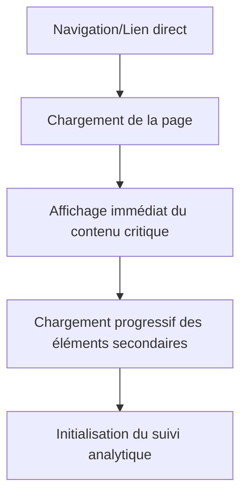

# Analyse UI/UX - Page de Détails Produit

## Vue d'ensemble

La page de détails produit d'HerbisVeritas présente une interface moderne et accessible, optimisée pour la consultation et l'achat de produits cosmétiques naturels. L'architecture suit les principes de design centrés utilisateur avec une attention particulière portée à l'accessibilité et à la performance.

## Architecture Technique

### Structure des Composants

```
src/app/[locale]/produits/[slug]/page.tsx     # Page principale (Server Component)
├── MainLayout                                # Layout principal minimaliste
└── ProductDetailDisplay                      # Composant d'affichage principal
    ├── QuantityInput                        # Contrôle de quantité animé
    ├── Price                                # Affichage du prix localisé
    ├── SubmitButton                         # Bouton d'ajout au panier
    └── Navigation par onglets              # Navigation fluide entre sections
```

### Technologies Utilisées

- **Framework**: Next.js 15 avec App Router et Server Components
- **Styling**: Tailwind CSS avec variables CSS personnalisées
- **Animations**: Framer Motion pour les micro-interactions
- **Internationalisation**: next-intl (support FR/EN/DE/ES)
- **Accessibilité**: ARIA, navigation clavier, lecteurs d'écran
- **State Management**: Zustand pour le panier, React Hook Form pour la validation

## Analyse de l'Interface Utilisateur

### Layout et Structure Visuelle

#### Section Principale (Hero)
```css
/* Layout principal responsive */
.main-container {
  max-width: 7xl;     /* 1280px */
  padding: 3rem 1rem; /* py-12 px-4 */
  margin: auto;
}

.content-grid {
  display: flex;
  flex-direction: column;    /* Mobile-first */
  gap: 1.5rem;              /* md:gap-12 sur desktop */
}

@media (min-width: 768px) {
  .content-grid {
    flex-direction: row;
    align-items: stretch;
  }
}
```

**Points forts UI :**
- Layout en deux colonnes sur desktop (image 50% / infos 50%)
- Design mobile-first avec stack vertical
- Espacement cohérent avec le système de design
- Utilisation sémantique des couleurs de marque

#### Galerie d'Images
- **Container** : `relative h-full w-full rounded-lg bg-card shadow-sm`
- **Image** : Utilisation de Next.js Image avec `object-contain object-center`
- **Responsive** : `sizes="(max-width: 768px) 100vw, 50vw"`
- **Fallback** : Image placeholder en cas d'absence

#### Section Informations
```tsx
// Structure hiérarchique claire
<header className="flex-grow space-y-3 sm:space-y-4">
  <h1 className="font-serif text-3xl font-bold lg:text-4xl">
  <p className="text-sm italic text-muted-foreground"> // Unité
  <p className="text-base leading-relaxed">              // Description courte
  <section className="bg-background p-4 shadow-lg rounded-xl"> // Zone d'achat
</header>
```

### Système de Navigation par Onglets

#### Design Pattern
- **Navigation sticky** : Positionnée en bas de la colonne d'informations
- **Scroll-spy** : Détection automatique de la section active via IntersectionObserver
- **Navigation fluide** : Ancres avec défilement smooth et offset pour header sticky

#### Implémentation Technique
```tsx
// Configuration de l'observateur d'intersection
const observerOptions = {
  rootMargin: "-120px 0px -50% 0px", // Compensation header sticky
  threshold: 0,
};

// États visuels des onglets
const tabClasses = clsx(
  "flex-shrink-0 whitespace-nowrap border-b-2 transition-colors duration-200",
  {
    "border-primary text-primary": activeTab === tab.id,
    "border-transparent text-muted-foreground hover:text-primary": activeTab !== tab.id,
  }
);
```

### Zone d'Achat (Call-to-Action)

#### Design Visuel
```css
.purchase-section {
  background: var(--background);
  padding: 1.5rem;           /* p-6 */
  border-radius: 0.75rem;    /* rounded-xl */
  box-shadow: 0 10px 15px -3px rgb(0 0 0 / 0.1); /* shadow-lg */
}
```

#### Composants d'Interaction

**Prix Principal :**
- Composant `Price` avec localisation automatique
- Couleur distinctive : `text-olive-600 text-2xl font-bold`
- Mention légale TTC en petit texte

**Contrôle de Quantité :**
- Design à trois parties (-, input, +) avec bordures fusionnées
- Animations tactiles : `whileTap={{ scale: 0.9 }}`
- Validation en temps réel avec limites min/max
- Optimisation mobile : `min-h-[44px]` pour zone de touch accessible

**Bouton d'Ajout :**
- État loading avec texte dynamique
- Couleur primaire de marque
- Taille généreuse : `h-12 text-lg font-semibold`

## Analyse de l'Expérience Utilisateur

### Parcours Utilisateur

#### 1. Arrivée sur la Page


**Optimisations UX :**
- Server-Side Rendering pour un affichage instantané
- Progressive loading des images avec placeholder
- Metadata SEO optimisés par produit

#### 2. Consultation du Produit
```
Scan visuel → Image produit → Nom et prix → Description courte → Call-to-Action
     ↓
Navigation vers détails (onglets) → Comparaison/recherche d'information → Décision d'achat
```

#### 3. Processus d'Ajout au Panier
```typescript
// Flow d'ajout au panier avec feedback utilisateur
const addToCartFlow = {
  userAction: "Click sur 'Ajouter au panier'",
  immediateUI: "Bouton passe en état loading",
  serverAction: "Validation + ajout en base",
  feedback: "Toast de confirmation",
  stateSync: "Synchronisation store Zustand",
  analytics: "Tracking de l'événement"
};
```

### Points Forts UX

#### 1. Accessibilité
- **Navigation clavier** : Tous les éléments focusables
- **Lecteurs d'écran** : Labels ARIA appropriés, structure sémantique
- **Contraste** : Respect des guidelines WCAG 2.1 AA
- **Tailles de touch** : Minimum 44px pour les éléments interactifs

```tsx
// Exemples d'implémentation accessible
<h2 id="product-purchase" className="sr-only">Achat du produit</h2>
<Button aria-label={t("decreaseQuantity")} disabled={value <= min}>
<Input inputMode="numeric" aria-label={t("quantity")} />
```

#### 2. Performance
- **Core Web Vitals** optimisés
- **Image optimization** : Next.js Image avec lazy loading
- **Bundle splitting** : Chargement conditionnel des composants
- **Server Components** : Réduction du JavaScript client

#### 3. Responsive Design
```css
/* Approche mobile-first */
.responsive-grid {
  /* Mobile (default) */
  flex-direction: column;
  gap: 1.5rem;
  
  /* Tablet et plus */
  @media (min-width: 768px) {
    flex-direction: row;
    gap: 3rem;
  }
}
```

#### 4. Micro-interactions
- Animations de feedback sur les boutons (Framer Motion)
- Transitions fluides entre les onglets (200ms)
- États hover/focus visibles et cohérents

### Points d'Amélioration Identifiés

#### 1. Galerie d'Images
**Problème :** Une seule image par produit
**Impact :** Limitation de la présentation visuelle
**Solution recommandée :**
```typescript
interface ProductImage {
  src: string;
  alt: string;
  isPrimary?: boolean;
  zoom?: boolean;
}

// Composant galerie avec navigation
<ImageGallery 
  images={product.images}
  showThumbnails={true}
  enableZoom={true}
  onImageChange={handleImageChange}
/>
```

#### 2. Information Architecture
**Problème :** Contenu potentiellement vide dans certaines sections
**Impact :** Onglets sans contenu utile
**Solution recommandée :**
```tsx
// Onglets conditionnels
const availableTabs = tabs.filter(tab => {
  switch(tab.id) {
    case 'properties': return product.properties;
    case 'composition': return product.compositionText || product.inciList?.length;
    case 'usage': return product.usageInstructions;
    default: return true;
  }
});
```

#### 3. Social Proof et Trust Signals
**Problème :** Absence d'éléments de réassurance
**Impact :** Peut affecter la conversion
**Solution recommandée :**
- Avis clients
- Certifications/labels
- Politique de retour
- Stock disponible/popularité

#### 4. Upselling et Cross-selling
**Problème :** Pas de recommandations produits
**Impact :** Perte d'opportunités de vente
**Solution recommandée :**
```tsx
<RecommendedProducts 
  currentProduct={product}
  strategy={["similar", "complementary", "frequently_bought"]}
  limit={4}
/>
```

## Conformité et Standards

### Accessibilité (WCAG 2.1 AA)

#### ✅ Points Conformes
- Contraste des couleurs ≥ 4.5:1
- Navigation clavier complète
- Labels ARIA descriptifs
- Structure sémantique HTML5
- Tailles de touch ≥ 44px

#### ⚠️ Points à Vérifier
- Test avec lecteurs d'écran sur contenu dynamique
- Validation des messages d'erreur
- Focus management après actions asynchrones

### Performance

#### Metrics Actuelles (estimées)
- **LCP** : < 2.5s (optimisé avec Server Components)
- **FID** : < 100ms (minimal JavaScript)
- **CLS** : < 0.1 (images avec dimensions fixes)

### SEO

#### ✅ Optimisations Présentes
```typescript
// Metadata dynamiques par produit
export async function generateMetadata({ params }): Promise<Metadata> {
  return {
    title: `${productName} | ${siteName}`,
    description: productDescription,
    openGraph: {
      title: productName,
      description: productDescription,
      images: [{ url: productImage }],
    }
  };
}
```

## Recommandations Stratégiques

### Court Terme (1-2 sprints)

1. **Optimisation de la galerie d'images**
   - Implémentation multi-images
   - Zoom/lightbox
   - Vignettes de navigation

2. **Amélioration des informations produit**
   - Onglets conditionnels
   - Formatage du contenu
   - Messages d'état vides plus informatifs

3. **Ajout d'éléments de réassurance**
   - Indicateurs de stock
   - Politique de retour visible
   - Certifications/labels

### Moyen Terme (3-5 sprints)

1. **Système d'avis clients**
   - Notation et commentaires
   - Photos client
   - Filtres et tri

2. **Recommandations produits**
   - Algorithme de suggestion
   - A/B testing des emplacements
   - Tracking de performance

3. **Optimisations conversion**
   - Urgence (stock faible)
   - Bundles/offres
   - Personalisation

### Long Terme (6+ sprints)

1. **Expérience immersive**
   - Réalité augmentée
   - Configurateur 3D
   - Vidéos produit

2. **Intelligence artificielle**
   - Chatbot produit
   - Recommandations personnalisées
   - Assistant beauté virtuel

## Métriques de Succès

### Métriques de Performance UX
```typescript
interface UXMetrics {
  pageLoadTime: number;      // < 3s target
  timeToInteractive: number; // < 2s target
  bounceRate: number;        // < 40% target
  avgSessionDuration: number; // > 2min target
}

interface ConversionMetrics {
  addToCartRate: number;     // Product page → Cart
  viewToConversionRate: number; // Product page → Purchase
  crossSellSuccess: number;  // Recommendations clicked
  returnCustomerRate: number; // Repeat purchases
}
```

### A/B Tests Recommandés

1. **Positionnement du CTA**
   - Sticky vs static
   - Couleur et taille du bouton
   - Texte du bouton

2. **Information hierarchy**
   - Ordre des onglets
   - Présentation du prix
   - Mise en avant des USP

3. **Galerie d'images**
   - Taille relative
   - Position des vignettes
   - Comportement zoom

## Conclusion

La page de détails produit d'HerbisVeritas présente une base solide avec une architecture technique moderne, une approche mobile-first, et une attention portée à l'accessibilité. L'interface est claire, performante et conforme aux standards web actuels.

Les principaux axes d'amélioration se concentrent sur l'enrichissement du contenu visuel (galerie d'images), l'ajout d'éléments de réassurance, et l'implémentation de fonctionnalités de social proof pour optimiser les taux de conversion.

L'architecture modulaire facilite l'évolution progressive du composant sans refonte majeure, permettant des itérations rapides basées sur les retours utilisateurs et les métriques de performance.

---

**Document créé le :** 8 septembre 2025  
**Version :** 1.0  
**Dernière mise à jour :** Analyse initiale basée sur le codebase actuel